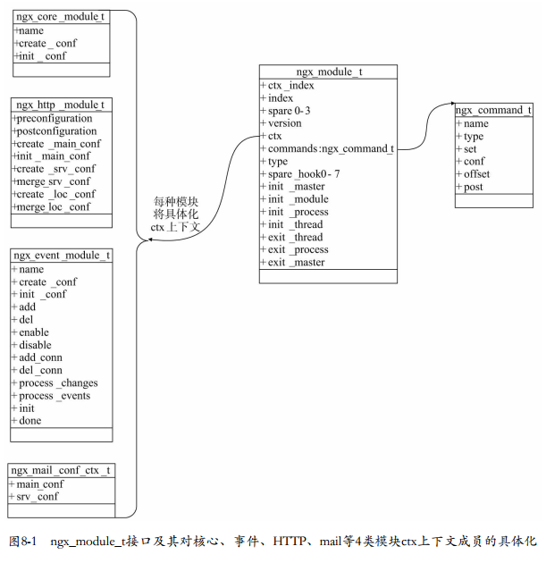
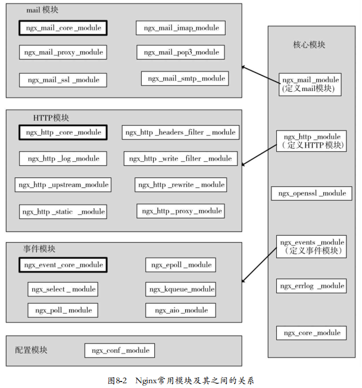
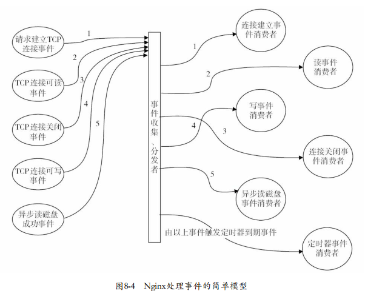
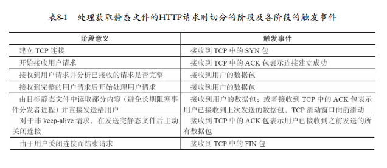
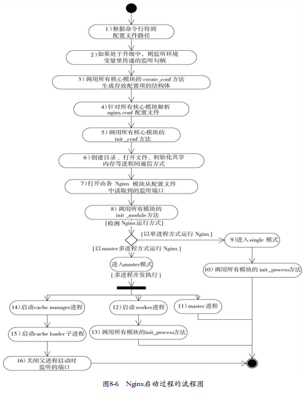
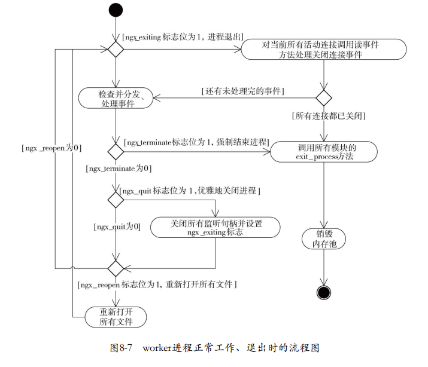
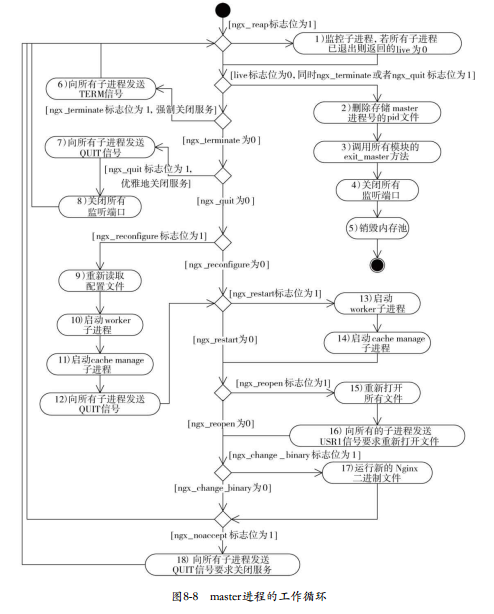
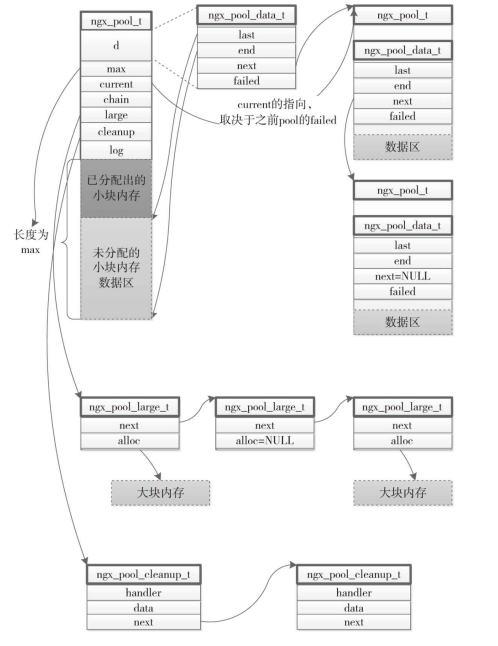

<!-- TOC -->

- [Web服务器设计中的关键约束](#web服务器设计中的关键约束)
- [nginx的架构设计](#nginx的架构设计)
    - [模块化设计](#模块化设计)
    - [事件驱动架构](#事件驱动架构)
    - [多阶段异步处理](#多阶段异步处理)
        - [4种方式来划分阶段](#4种方式来划分阶段)
        - [管理进程、多工作进程设计](#管理进程多工作进程设计)
        - [内存池的设计](#内存池的设计)
- [nginx框架中的核心结构体ngx_cycle_t](#nginx框架中的核心结构体ngx_cycle_t)
    - [ngx_listening_t结构体](#ngx_listening_t结构体)
    - [ngx_cycle_t结构体](#ngx_cycle_t结构体)
    - [ngx_cycle_t支持的方法 (详细参考书籍)](#ngx_cycle_t支持的方法-详细参考书籍)
- [Nginx启动时框架的处理流程](#nginx启动时框架的处理流程)
- [worker进程是如何工作的](#worker进程是如何工作的)
- [master进程是如何工作的](#master进程是如何工作的)
- [ngx_pool_t内存池](#ngx_pool_t内存池)

<!-- /TOC -->


<a id="markdown-web服务器设计中的关键约束" name="web服务器设计中的关键约束"></a>
## Web服务器设计中的关键约束

1. 性能

    性能是nginx的根本，如果性能无法超越Apache，那么它也就没有存在的意义了。这里所说的性能主体是Web服务器，因此，性能这个概念主要是从网络角度出发的，它包含以下3个概念。
    - 网络性能

        这里的网络性能不是针对一个用户而言的，而是针对nginx服务而言的。网络性能是指在不同负载下，Web服务在网络通信上的吞吐量。而带宽这个概念，就是指在特定的网络连接上可以达到的最大吞吐量。因此，网络性能肯定会受制于带宽，当然更多的是受制于Web服务的软件架构。

        在大多数场景下，随着服务器上并发连接数的增加，网络性能都会有所下降。目前，我们在谈网络性能时，更多的是对应于高并发场景。例如，在几万或者几十万并发连接下，要求我们的服务器仍然可以保持较高的网络吞吐量，而不是当并发连接数达到一定数量时，服务器的CPU等资源大都浪费在进程间切换、休眠、等待等其他活动上，导致吞吐量大幅下降。
    - 单次请求的延迟性

        单次请求的延迟性与上面说的网络性能的差别很明显，这里只是针对一个用户而言的。对于Web服务器，延迟性就是指服务器初次接收到一个用户请求直至返回响应之间持续的时间。
        服务器在低并发和高并发连接数量下，单个请求的平均延迟时间肯定是不同的。nginx在设计时更应该考虑的是在高并发下如何保持平均时延性，使其不要上升得太快。

    - 网络效率

        网络效率很好理解，就是使用网络的效率。例如，使用长连接(keepalive) 代替短连接以减少建立、关闭连接带来的网络交互，使用压缩算法来增加相同吞吐量下的信息携带量，使用缓存来减少网络交互次数等，它们都可以提高网络效率。
2. 可伸缩性

    可伸缩性指架构可以通过添加组件来提升服务，或者允许组件之间具有交互功能。一般可以通过简化组件、降低组件间的耦合度、将服务分散到许多组件等方法来改善可伸缩性。可伸缩性受到组件间的交互频率，以及组件对一个请求是使用同步还是异步的方式来处理等条件制约。
3. 简单性

    简单性通常指组件的简单程度，每个组件越简单，就会越容易理解和实现，也就越容易被验证(被测试) 。一般，我们通过分离关注点原则来设计组件，对于整体架构来说，通常使用通用性原则，统一组件的接口，这样就减少了架构中的变数。
4. 可修改性

    简单来讲，可修改性就是在当前架构下对于系统功能做出修改的难易程度，对于Web服务器来说，它还包括动态的可修改性，也就是部署好Web服务器后可以在不停止、不重启服务的前提下，提供给用户不同的、符合需求的功能。可修改性可以进一步分解为可进化性、可扩展性、可定制性、可配置性和可重用性，下面简单说明一下这些概念。

    - 可进化性

        可进化性表示我们在修改一个组件时，对其他组件产生负面影响的程度。当然，每个组件的可进化性都是不同的，越是核心的组件其可进化性可能会越低，也就是说，对这个组件的功能做出修改时可能同时必须修改其他大量的相关组件。
        对于Web服务器来说，“进化”这个概念按照服务是否在运行中又可以分为静态进化和动态进化。优秀的静态进化主要依赖于架构的设计是否足够抽象，而动态进化则不然，它与整个服务的设计都是相关的。

    - 可扩展性

        可扩展性表示将一个新的功能添加到系统中的能力(不影响其他功能) 。与可进化性一样，除了静态可扩展性外，还有动态可扩展性(如果已经部署的服务在不停止、不重启情况下添加新的功能，就称为动态可扩展性) 。

    - 可定制性

        可定制性是指可以临时性地重新规定一个组件或其他架构元素的特性，从而提供一种非常规服务的能力。如果某一个组件是可定制的，那么是指用户能够扩展该组件的服务，而不会对其他客户产生影响。支持可定制性的风格一般会提高简单性和可扩展性，因为通常情况下只会实现最常用的功能，不太常用的功能则交由用户重新定制使用，这样组件的复杂性就降低了，整个服务也会更容易扩展。

    - 可配置性

        可配置性是指在Web服务部署后，通过对服务提供的配置文件进行修改，来提供不同的功能。它与可扩展性、可重用性相关。

    - 可重用性

        可重用性指的是一个应用中的功能组件在不被修改的情况下，可以在其他应用中重用的程度。
5. 可见性

    在Web服务器这个应用场景中，可见性通常是指一些关键组件的运行情况可以被监控的程度。例如，服务中正在交互的网络连接数、缓存的使用情况等。通过这种监控，可以改善服务的性能，尤其是可靠性。
6. 可移植性

    可移植性是指服务可以跨平台运行，这也是当下nginx被大规模使用的必要条件。
7. 可靠性

    可靠性可以看做是在服务出现部分故障时，一个架构容易受到系统层面故障影响的程度。可以通过以下方法提高可靠性： 避免单点故障、增加冗余、允许监视，以及用可恢复的动作来缩小故障的范围。


<a id="markdown-nginx的架构设计" name="nginx的架构设计"></a>
## nginx的架构设计

<a id="markdown-模块化设计" name="模块化设计"></a>
### 模块化设计

`除了核心代码之外，一切皆模块` 如下图

<span id="ngx-module-s" name="ngx_module_s"></span>
```c
/*
    配置模块与核心模块都是与nginx框架密切相关的，是其他模块的基础。而事件模块则是HTTP模块和mail模块的基础，原因参见8.2.2节。
    HTTP模块和mail模块的“地位”相似，它们都更关注于应用层面。在事件模块中，ngx_event_core module事件模块是其他所有事件模块
    的基础；在HTTP模块中，ngx_http_core module模块是其他所有HTTP模块的基础；在mail模块中，ngx_mail_core module模块是其他所
    有mail模块的基础。
*/
// 相关空间初始化，赋值等可以参考ngx_http_block
struct ngx_module_s {
    /*
        对于一类模块(由下面的type成员决定类别)而言，ctx_index表示当前模块在这类模块中的序号。这个成员常常是由管理这类模块的一个
        nginx核心模块设置的，对于所有的HTTP模块而言，ctx_index是由核心模块ngx_http_module设置的。ctx_index非常重要，nginx的模块化
        设计非常依赖于各个模块的顺序，它们既用于表达优先级，也用于表明每个模块的位置，借以帮助nginx框架快速获得某个模块的数据()

         ctx index表明了模块在相同类型模块中的顺序
    */
    ngx_uint_t          ctx_index; //初始化赋值见ngx_http_block, 这个值是按照在http_modules中的位置顺序来排序的，见ngx_http_block
    /*
        index表示当前模块在ngx_modules数组中的序号。注意，ctx_index表示的是当前模块在一类模块中的序号，而index表示当前模块在所有模块中的序号，
        它同样关键。nginx启动时会根据ngx_modules数组设置各模块的index值。例如：
        ngx_max_module = 0;
        for (i = 0; ngx_modules[i]; i++) {
            ngx_modules[i]->index = ngx_max_module++;
        }

        模块在所有模块中的序号，是第几个模块
    */
    ngx_uint_t          index;
    /*
        spare系列的保留变量，暂未使用
    */
    ngx_uint_t          spare0;
    ngx_uint_t          spare1;
    ngx_uint_t          spare2;
    ngx_uint_t          spare3;
    ngx_uint_t          version;   // 模块的版本，便于将来的扩展。目前只有一种，默认为1
    /*
        ctx用于指向一类模块的上下文结构体，为什么需要ctx呢？因为前面说过，nginx模块有许多种类，不同类模块之间的功能差别很大。例如，
        事件类型的模块主要处理I/O事件相关的功能，HTTP类型的模块主要处理HTTP应用层的功能。这样，每个模块都有了自己的特性，而ctx将会
        指向特定类型模块的公共接口。例如，在HTTP模块中，ctx需要指向ngx_http_module_t结构体,可以参考例如ngx_http_core_module, 
        event模块中，指向ngx_event_module_t
    */
    void                *ctx;      // HTTP框架初始化时完成的
    ngx_command_t       *commands; // commands将处理nginx.conf中的配置项
    /*    
        结构体中的type字段决定了该模块的模块类型：        
        core module对应的值为NGX_CORE_MODULE
        http module对应的值为NGX_HTTP_MODULE
        mail module对应的值为NGX_MAIL_MODULE
        event module对应的值为NGX_EVENT_MODULE
        每个大模块中都有一些具体功能实现的子模块，如ngx_lua模块就是http module中的子模块。      
        type表示该模块的类型，它与ctx指针是紧密相关的。在官方nginx中，它的取值范围是以下5种：NGX_HTTP_MODULE、NGX_CORE_MODULE、
        NGX_CONF_MODULE、NGX_EVENT_MODULE、NGX_MAIL_MODULE。这5种模块间的关系参考图8-2。实际上，还可以自定义新的模块类型
    */
    ngx_uint_t          type;    
    /*
        在nginx的启动、停止过程中，以下7个函数指针表示有7个执行点会分别调用这7种方法()。对于任一个方法而言，
        如果不需要nginx在某个时刻执行它，那么简单地把它设为NULL空指针即可
        对于下列回调方法：init_module、init_process、exit_process、exit_master，调用它们的是nginx的框架代码。换句话说，这4个回调方法
        与HTTP框架无关，即使nginx.conf中没有配置http {...}这种开启HTTP功能的配置项，这些回调方法仍然会被调用。因此，通常开发HTTP模块
        时都把它们设为NULL空指针。这样，当nginx不作为Web服务器使用时，不会执行HTTP模块的任何代码。
    */
    /*
        虽然从字面上理解应当在master进程启动时回调init_master，但到目前为止，框架代码从来不会调用它，因此，可将init_master设为NULL
    */
    ngx_int_t           (*init_master)(ngx_log_t *log); //实际上没用
    /*
        init_module回调方法在初始化所有模块时被调用。在master/worker模式下，这个阶段将在启动worker子进程前完成
    */
    ngx_int_t           (*init_module)(ngx_cycle_t *cycle); //ngx_init_cycle中调用，在解析玩所有的nginx.conf配置后才会调用模块的ngx_conf_parse
    /*
        init_process回调方法在正常服务前被调用。在master/worker模式下，多个worker子进程已经产生，在每个worker进程的初始化过程会调用所有模块的init_process函数
    */
    ngx_int_t           (*init_process)(ngx_cycle_t *cycle); //ngx_worker_process_init或者ngx_single_process_cycle中调用
    /*
        由于nginx暂不支持多线程模式，所以init_thread在框架代码中没有被调用过，设为NULL
    */
    ngx_int_t           (*init_thread)(ngx_cycle_t *cycle); //实际上没用    
    /*
        由于nginx暂不支持多线程模式，所以exit_thread 在框架代码中没有被调用过，设为NULL
        同上，exit_thread也不支持，设为NULL
    */
    void                (*exit_thread)(ngx_cycle_t *cycle);//实际上没用    
    /*
        exit_process回调方法在服务停止前调用。在master/worker模式下，worker进程会在退出前调用它，见ngx_worker_process_exit
    */
    void                (*exit_process)(ngx_cycle_t *cycle); //ngx_single_process_cycle 或者 ngx_worker_process_exit中调用
    /*
        exit_master回调方法将在master进程退出前被调用
    */
    void                (*exit_master)(ngx_cycle_t *cycle); //ngx_master_process_exit中调用    
    /*
        以下8个spare_hook变量也是保留字段，目前没有使用，但可用nginx提供的NGX_MODULE_V1_PADDING宏来填充。看一下该宏的定义：
        #define NGX_MODULE_V1_PADDING  0, 0, 0, 0, 0, 0, 0, 0
    */
    uintptr_t           spare_hook0;
    uintptr_t           spare_hook1;
    uintptr_t           spare_hook2;
    uintptr_t           spare_hook3;
    uintptr_t           spare_hook4;
    uintptr_t           spare_hook5;
    uintptr_t           spare_hook6;
    uintptr_t           spare_hook7;
};

typedef struct ngx_module_s  ngx_module_t;
```


- 高度抽象的模块接口

    所有的模块都遵循着同样的ngx_module_t接口设计规范，这减少了整个系统中的变数.

- 模块接口非常简单，具有很高的灵活性

    - 只涉及到模块的初始化，退出以及配置项处理，所以可以比较简单的实现动态可修改性
    - 定义7个回调方法(3个目前未使用)[struct ngx_module_s](#ngx-module-s)，由于权限非常高，所以可以处理系统核心结构体[struct ngx_cycle_t](#ngx-cycle-t)，下面可以看到如何回调这些方法
    - ngx_command_t类型数组：commands数组则指定了模块处理配置项的方法
    - ctx 万能类型 void*指针[一个实例](#ngx-core-module-t)，它可以指向任何数据，这给模块提供了很大的灵活性，使得下面将要介绍的多层次、多类型的模块设计成为可能。ctx成员一般用于表示在不同类型的模块中一种类型模块所具备的通用性接口

- 配置模块的设计
    - type 成员，指明了nginx允许在设计模块时定义模块类型这个概念，允许专注于不同领域的模块按照类型来区别

- 核心模块接口的简化
    - 非核心模块只需要关注怎么调用个核心模块即可
    - 6个核心模块
     结构体中的type字段决定了该模块的模块类型：        
        - ngx_core_module: NGX_CORE_MODULE
        - ngx_errlog_module: NGX_ERRLOG_MODULE
        - ngx_events_module: NGX_EVENT_MODULE
        - ngx_openssl_module: NGX_OPENSSL_MODULE
        - ngx_http_module: NGX_HTTP_MODULE
        - ngx_mail_module: NGX_MAIL_MODULE
    <span id="ngx-core-module-t" name="ngx_core_module_t"></span>
    ```c
    // ngx_core_module_t是核心模块结构体，包含一个模块名称以及两个指针函数create_conf和init_conf
    typedef struct {
        ngx_str_t    name;
        void         *(*create_conf)(ngx_cycle_t *cycle);
        char         *(*init_conf)(ngx_cycle_t *cycle, void *conf);
    } ngx_core_module_t;

    // ngx_core_module_t是核心模块结构体，包含一个模块名称以及两个指针函数create_conf和init_conf
    // 具体定义见./src/core/ngx_conf_file.h文件
    // 下面是定义全局的核心模块上下文ngx_core_module_ctx
    static ngx_core_module_t ngx_core_module_ctx = {
        ngx_string("core"),                              // 模块名称
        ngx_core_module_create_conf,                     // 创建配置的指针函数
        ngx_core_module_init_conf                        // 初始化配置的指针函数
    };
    // 赋值方式
    ngx_module_t->ctx = (void*)ngx_core_module_ctx; 
    ```
- 多层次、多类别的模块设计

    所有的模块间是分层次、分类别的，官方nginx共有五大类型的模块： 核心模块、配置模块、事件模块、HTTP模块、mail模块。虽然它们都具备相同的ngx_module_t接口，但在请求处理流程中的层次并不相同

如图



- 总结

    - 配置模块与核心模块都是与nginx框架密切相关的，是其他模块的基础
    - 事件模块则是HTTP模块和mail模块的基础
    - Nginx框架会调用核心模块，但是其它三种模块都不会与框架产生关系
    - HTTP模块和mail模块的“地位”相似，它们都更关注于应用层面
    - 在事件模块中，`ngx_event_core_module` 事件模块是其他所有事件模块的基础
    - 在HTTP模块中，`ngx_http_core_module` 模块是其他所有HTTP模块的基础
    - 在mail模块中，`ngx_mail_core_module` 模块是其他所有mail模块的基础

<a id="markdown-事件驱动架构" name="事件驱动架构"></a>
### 事件驱动架构

所谓事件驱动架构，简单来说，就是由一些事件发生源来产生事件，由一个或者多个事件收集器来收集、分发事件，然后许多事件处理器会注册自己感兴趣的事件，同时会“消费”这些事件

事件模块将负责事件的收集、分发操作，而所有的模块都可能是事件消费者，它们首先需要向事件模块注册感兴趣的事件类型，这样，在有事件产生时，事件模块会把事件分发到相应的模块中进行处理

nginx不会使用进程或线程来作为事件消费者，所谓的事件消费者只能是某个模块（在这里没有进程的概念）。只有事件收集、分发器才有资格占用进程资源，它们会在分发某个事件时调用事件消费模块使用当前占用的进程资源，事件消费者只是被事件分发者进程短期调用而已，所以每个事件消费者都不能有阻塞行为，否则将会由于长时间占用事件分发者进程而导致其他事件得不到及时响应。尤其是每个事件消费者不可以让进程转变为休眠状态或等待状态，如在等待一个信号量条件的满足时会使进程进入休眠状态。这加大了事件消费程序的开发者的编程难度，因此，这也导致了nginx的模块开发相对于Apache来说复杂不少。



<a id="markdown-多阶段异步处理" name="多阶段异步处理"></a>
### 多阶段异步处理

多阶段异步处理请求与事件驱动架构是密切相关的，换句话说，请求的多阶段异步处理只能基于事件驱动架构实现，所以需要将他划分为多个可以用于事件收集，分发器来触发



这个例子中大致分为7个阶段，这些阶段是可以重复发生的，因此，一个下载静态资源请求可能会由于请求数据过大、网速不稳定等因素而被分解为成百上千个列出的阶段

<a id="markdown-4种方式来划分阶段" name="4种方式来划分阶段"></a>
#### 4种方式来划分阶段

- 将阻塞进程的方法按照相关的触发事件分解为两个阶段

    一个本身可能导致进程休眠的方法或系统调用，一般都能够分解为多个更小的方法或者系统调用，这些调用间可以通过事件触发关联起来。
    大部分情况下，一个阻塞进程的方法调用时可以划分为两个阶段： 

    - 阻塞方法改为非阻塞方法调用，这个调用非阻塞方法并将进程归还给事件分发器的阶段就是第一阶段
    - 增加新的处理阶段（第二阶段）用于处理非阻塞方法最终返回的结果，这里的结果返回事件就是第二阶段的触发事件。

```sh
    阻塞模型：
    在使用send调用发送数据给用户时，如果使用阻塞socket句柄，那么send调用在向操作系统内核发出数据包后就必须把当前进程休眠，直到成功发出数据才能“醒来”。这时的send调用发送数据并等待结果。

    分阶段：
    我们需要把send调用分解为两个阶段： 
        1. 发送且不等待结果阶段、send结果返回阶段。因此，可以使用非阻塞socket句柄，这样调用send发送数据后，进程是不会进入休眠的，这就是发送且不等待结果阶段；
        2. 把socket句柄加入到事件收集器中就可以等待相应的事件触发下一个阶段，send发送的数据被对方收到后这个事件就会触发send结果返回阶段。
```

- 将阻塞方法调用按照时间分解为多个阶段的方法调用

    对于无法按照改用非阻塞方式的阻塞调用，通过设置`简单的定时器事件`，将其改装成可控的占用进程不长的短调用

- 在“无所事事”且必须等待系统的响应，从而导致进程空转时，使用定时器划分阶段

    有时阻塞的代码段可能是这样的： 进行某个无阻塞的系统调用后，必须通过持续的检查标志位来确定是否继续向下执行，当标志位没有获得满足时就循环地检查下去。这样的代码段本身没有阻塞方法调用，可实际上是阻塞进程的。这时，应该使用定时器来代替循环检查标志，这样定时器事件发生时就会先检查标志，如果标志位不满足，就立刻归还进程控制权，同时继续加入期望的下一个定时器事件。

- 如果阻塞方法完全无法继续划分，则必须使用独立的进程执行这个阻塞方法

    针对必须要独立进程执行的阻塞方法，可以拆分成两个阶段，一旦出现上面这种设计，我们必须审视这样的事件消费者是否足够合理，有没有必要用这种违反事件驱动架构的方式来解决阻塞问题
    - 阻塞方法执行前阶段，阻塞方法的执行要使用单独的进程去调度，并在方法返回后发送事件通知
    - 阻塞方法执行后阶段，接受完成事件通知，并向事件收集、分发者进程发送事件通知继续执行

<a id="markdown-管理进程多工作进程设计" name="管理进程多工作进程设计"></a>
#### 管理进程、多工作进程设计

Master-work 模式，完全相同的worker进程、1个可选的cache manager进程以及1个可选的cache loader进程。

优点：

1. 利用多核系统的并发处理能力

    现代操作系统已经支持多核CPU架构，这使得多个进程可以占用不同的CPU核心来工作。如果只有一个进程在处理请求，则必然会造成CPU资源的浪费！ 如果多个进程间的地位不平等，则必然会有某一级同一地位的进程成为瓶颈，因此，nginx中所有的worker工作进程都是完全平等的。这提高了网络性能、降低了请求的时延。

2. 负载均衡

    多个worker工作进程间通过进程间通信来实现负载均衡，也就是说，一个请求到来时更容易被分配到负载较轻的worker工作进程中处理。这将降低请求的时延，并在一定程度上提高网络性能。

3. 管理进程会负责监控工作进程的状态，并负责管理其行为

    管理进程不会占用多少系统资源，它只是用来启动、停止、监控或使用其他行为来控制工作进程。首先，这提高了系统的可靠性，当工作进程出现问题时，管理进程可以启动新的工作进程来避免系统性能的下降。其次，管理进程支持nginx服务运行中的程序升级、配置项的修改等操作，这种设计使得动态可扩展性、动态定制性、动态可进化性较容易实现。

<a id="markdown-内存池的设计" name="内存池的设计"></a>
#### 内存池的设计

为了避免出现内存碎片、减少向操作系统申请内存的次数、降低各个模块的开发复杂度，nginx设计了简单的内存池。这个内存池没有很复杂的功能： 通常它不负责回收内存池中已经分配出的内存。这种内存池最大的优点在于： 把多次向系统申请内存的操作整合成一次，这大大减少了CPU资源的消耗，同时减少了内存碎片。

<a id="markdown-nginx框架中的核心结构体ngx_cycle_t" name="nginx框架中的核心结构体ngx_cycle_t"></a>
## nginx框架中的核心结构体ngx_cycle_t
<span id="ngx-cycle-t" name="ngx_cycle_t"></span>
nginx核心的框架代码一直在围绕着一个结构体展开，它就是ngx_cycle_t。无论是master管理进程、worker工作进程还是cache manager（loader）进程，每一个进程都毫无例外地拥有唯一一个ngx_cycle_t结构体。服务在初始化时就以ngx_cycle_t对象为中心来提供服务，在正常运行时仍然会以ngx_cycle_t对象为中心。

<a id="markdown-ngx_listening_t结构体" name="ngx_listening_t结构体"></a>
### ngx_listening_t结构体

ngx_cycle_t对象中有一个动态数组成员叫做listening，它的每个数组元素都是ngx_listening_t结构体，而每个ngx_listening_t结构体又代表着nginx服务器监听的一个端口

```c

typedef struct ngx_listening_s ngx_listening_t;

struct ngx_listening_s {
    ...
    // 当新的TCP连接成功建立后的处理方法
    ngx_connection_handler_pt handler;
    // 当前监听句柄对应着的 ngx_connection_t结构体
    ngx_connection_t *connection;
    ...
};

```

ngx_connection_handler_pt类型的handler成员表示在这个监听端口上成功建立新的TCP连
接后，就会回调handler方法，它的定义很简单，如下所示。

`typedef void (*ngx_connection_handler_pt)(ngx_connection_t *c);`

它接收一个ngx_connection_t连接参数。许多事件消费模块（如HTTP框架、mail框架）都会自定义上面的handler方法。

<a id="markdown-ngx_cycle_t结构体" name="ngx_cycle_t结构体"></a>
### ngx_cycle_t结构体

nginx框架是围绕着ngx_cycle_t结构体来控制进程运行的。ngx_cycle_t结构体的prefix、conf_prefix、conf_file等字符串类型成员保存着nginx配置文件的路径，nginx的可配置性完全依赖于nginx.conf配置文件，nginx所有模块的可定制性、可伸缩性等诸多特性也是依赖于nginx.conf配置文件的，可以想见，这个配置文件路径必然是保存在ngx_cycle_t结构体中的。

有了配置文件后，nginx框架就开始根据配置项来加载所有的模块了，这一步骤会在ngx_init_cycle方法中进行 。ngx_init_cycle方法，顾名思义，就是用来构造ngx_cycle_t结构体中成员的，首先来介绍一下ngx_cycle_t中的成员(下面提到的connections、read_events、write_events、files、free_connections等成员，它们是与事件模块强相关的)

```c
//我们来看一看这神奇的ngx_cycle_s结构体吧,看一看庐山真面目.  
struct ngx_cycle_s {  
    /*
        保存着所有模块配置项的结构体指针p,它首先是一个数组, 该数组每个成员又是一个指针,这个指针又指向了存储着指针的数组.
    */  
    void                      ****conf_ctx;    
    /* 内存池 */
    ngx_pool_t                *pool;  
    /*
        日志模块中提供了生成基本ngx_log_t日志对象的功能, 这里的log实际上是在在没有执行ngx_init_cycle方法前, 也就是还没有解析配置项前,
        如果有信息需要输出到日志, 就会暂时使用log对象,它会输出到屏幕.在执行ngx_init_cycle方法后, 会根据nginx.conf配置文件中的配置项,
        构造出正确的日志文件, 此时会对log重新赋值.
    */  
    ngx_log_t                 *log;    
    /*
        由nginx.conf配置文件读取到日志路径后,将开始初始化error_log日志文件, 由于log对象还在用于输出日志到屏幕,这时候new_log将暂时替代log, 
        待初始化成功后,会用new_log的地址覆盖上面的指针.
    */  
    ngx_log_t                 new_log;  
  
    /* 下面files数组里元素的总数 */
    ngx_uint_t                files_n;  
    /* 
        对于epoll,rtsig这样的事件模块,会以有效文件句柄树来预先建立这些ngx_connection_t结构体,以加速事件的收集,分发
        这时files就会保存所有ngx_connection_t的指针组成的数组,而文件句柄的值用来访问files数组成员.
    */
    ngx_connection_t          **files;    
    /* 可用连接池,与free_connection_n配合使用 */
    ngx_connection_t          *free_connections;  
    /* 连接池的个数 */
    ngx_uint_t                free_connection_n;    
    /* 可重用的连接队列 */
    ngx_queue_t               reusable_connections_queue;  
    /* 动态数组,每个成员存储ngx_listening_t成员,表示监听端口以及相关的参数 */
    ngx_array_t               listening;  
    /*
        动态数组,保存着nginx所有要操作的目录,如果目录不在,将创建, 如果创建失败(例如权限不够),nginx将启动失败.
    */
    ngx_array_t               paths;
    /*
        单链表容器,元素类型是ngx_open_file_t结构体,他表示nginx已经打开的所有文件. 事实上nginx框架不会向open_files链表中添加文件, 
        而是由对此感兴趣的模块向其中添加文件路径名, nginx会在ngx_init_cycle方法中打开这些文件.
    */
    ngx_list_t                open_files;     
    /* 单链表容器,每一个元素表示一块共享内存 */  
    ngx_list_t                shared_memory;
    /* 当前进程中所有连接对象的总数,于下面的connections成员配合使用. */
    ngx_uint_t                connection_n;  
    /* 指向当前进程中多有连接对象 */
    ngx_connection_t          *connections;  
    /* 指向当前进程中所有读事件 */
    ngx_event_t               *read_events;  
    /* 指向当前进程中所有写事件 */
    ngx_event_t               *write_events;  
    /*
        旧的ngx_cycle_t对象,用于引用上一个ngx_cycle_t对象中的成员. 例如 ngx_init_cycle方法在启动初期,需要建立一个临时ngx_cycle_t对象来保存一些变量,
        再调用ngx_init_cycle方法时,就可以把旧的ngx_cycle_t对象传进去,而这时,这个old_cycle指针就会保存这个前期的ngx_cycle_t对象
    */  
    ngx_cycle_t               *old_cycle;  
    /* 配置文件相对于安装目录的路径 */
    ngx_str_t                 conf_file;  
    /* nginx处理配置文件时需要特殊处理的在命令行携带的参数, 一般是 -g选项携带的参数 */
    ngx_str_t                 conf_param;  
    /* nginx配置文件路径 */
    ngx_str_t                 conf_prefix;  
    /* nginx安装路径 */
    ngx_str_t                 prefix;  
    /* 用于进程间同步的文件所名称 */
    ngx_str_t                 lock_file;  
    /* 使用gethostname系统调用得到的主机名 */
    ngx_str_t                 hostname;  
}; 
```

<a id="markdown-ngx_cycle_t支持的方法-详细参考书籍" name="ngx_cycle_t支持的方法-详细参考书籍"></a>
### ngx_cycle_t支持的方法 (详细参考书籍)

与ngx_cycle_t核心结构体相关的方法实际上是非常多的。例如，每个模块都可以通过init_module、init_process、exit_process、exit_master等方法操作进程中独有的ngx_cycle_t结构体。然而，Nginx的框架代码中关于ngx_cycle_t结构体的方法并不是太多

- ngx_init_cycle方法的流程可参照图8-6中的第3步(调用所有核心模块的create_conf方法) ~ 第8步(调用所有模块的init_module方法)之间的内容；
- ngx_worker_process_cycle方法可部分参照图8-7(图8-7中缺少调用ngx_worker_process_init方法)
- ngx_master_process_cycle监控、管理子进程的流程

<a id="markdown-nginx启动时框架的处理流程" name="nginx启动时框架的处理流程"></a>
## Nginx启动时框架的处理流程



1. 在Nginx启动时，首先会解析命令行，处理各种参数。因为Nginx是以配置文件作为核心提供服务的，所以最主要的就是确定配置文件nginx.conf的路径。这里会预先创建一个临时的ngx_cycle_t类型变量，用它的成员存储配置文件路径（实际上还会使用这个临时ngx_cycle_t结构体的其他成员，如log成员会指向屏幕输出日志），最后调用表8-2中的ngx_process_options方法来设置配置文件路径等参数。
2. 图8-6中的第2步实际上就是在调用表8-2中的ngx_add_inherited_sockets方法。Nginx在不重启服务升级时，也就是我们说过的平滑升级（参见1.9节）时，它会不重启master进程而启动新版本的Nginx程序。这样，旧版本的master进程会通过execve系统调用来启动新版本的master进程（先fork出子进程再调用exec来运行新程序），这时旧版本的master进程必须要通过一种方式告诉新版本的master进程这是在平滑升级，并且传递一些必要的信息。Nginx是通过环境变量来传递这些信息的，新版本的master进程通过ngx_add_inherited_sockets方法由环境变量里读取平滑升级信息，并对旧版本Nginx服务监听的句柄做继承处理。
3. 第3步~第8步，都是在ngx_init_cycle方法中执行的。在初始化ngx_cycle_t中的所有容器后，会为读取、解析配置文件做准备工作。因为每个模块都必须有相应的数据结构来存储配置文件中的各配置项，创建这些数据结构的工作都需要在这一步进行。Nginx框架只关心NGX_CORE_MODULE核心模块，这也是为了降低框架的复杂度。这里将会调用所有核心模块的create_conf方法（也只有核心模块才有这个方法），这意味着需要所有的核心模块开始构造用于存储配置项的结构体。其他非核心模块怎么办呢？ 其实很简单。这些模块大都从属于一个核心模块，如每个HTTP模块都由ngx_http_module管理（如图8-2所示），这样ngx_http_module在解析自己感兴趣的“http”配置项时，将会调用所有HTTP模块约定的方法来创建存储配置项的结构体（如第4章中介绍过的xxx_create_main_conf、xxx_create_srv_conf、xxx_create_loc_conf方法）。
4. 调用配置模块提供的解析配置项方法。遍历nginx.conf中的所有配置项，对于任一个配置项，将会检查所有核心模块以找出对它感兴趣的模块，并调用该模块在ngx_command_t结构体中定义的配置项处理方法。这个流程可以参考图4-1。
5. 调用所有NGX_CORE_MODULE核心模块的init_conf方法。这一步骤的目的在于让所有核心模块在解析完配置项后可以做综合性处理。
6. 在之前核心模块的init_conf或者create_conf方法中，可能已经有些模块（如缓存模块）在ngx_cycle_t结构体中的pathes动态数组和open_files链表中添加了需要打开的文件或者目录，本步骤将会创建不存在的目录，并把相应的文件打开。同时，ngx_cycle_t结构体的shared_memory链表中将会开始初始化用于进程间通信的共享内存。
7. 之前第4步在解析配置项时，所有的模块都已经解析出自己需要监听的端口，如HTTP模块已经在解析http{...}配置项时得到它要监听的端口，并添加到listening数组中了。这一步骤就是按照listening数组中的每一个gx_listening_t元素设置socket句柄并监听端口（实际上，这一步骤的主要工作就是调用表8-2中的ngx_open_listening_sockets方法）。
8. 在这个阶段将会调用所有模块的init_module方法。接下来将会根据配置的Nginx运行模式决定如何工作。
9. 如果nginx.conf中配置为单进程工作模式，这时将会调用ngx_single_process_cycle方法进入单进程工作模式。
10. 调用所有模块的init_process方法。单进程工作模式的启动工作至此全部完成，将进入正常的工作模式，也就是8.5节和8.6节分别介绍的worker进程工作循环、master进程工作循环的结合体。
11. 如果进入master、worker工作模式，在启动worker子进程、cache manage子进程、cache loader子进程后，就开始进入8.6节提到的工作状态，至此，master进程启动流程执行完毕。
12. 由master进程按照配置文件中worker进程的数目，启动这些子进程（也就是调用表8-2中的ngx_start_worker_processes方法）。
13. 调用所有模块的init_process方法。worker进程的启动工作至此全部完成，接下来将进入正常的循环处理事件流程，也就是8.5节中介绍的worker进程工作循环的ngx_worker_process_cycle方法。
14. 在这一步骤中，由master进程根据之前各模块的初始化情况来决定是否启动cachemanage子进程，也就是根据ngx_cycle_t中存储路径的动态数组pathes中是否有某个路径的manage标志位打开来决定是否启动cache manage子进程。如果有任何1个路径的manage标志位为1，则启动cache manage子进程。
15. 与第14步相同，如果有任何1个路径的loader标志位为1，则启动cache loader子进程。对于第14步和第15步而言，都是与文件缓存模块密切相关的，但本章不会详述。
16. 关闭只有worker进程才需要监听的端口。

在以上16个步骤中，简要地列举出了Nginx在单进程模式和master工作方式下的启动流程，这里仅列举出与Nginx框架密切相关的步骤，并未涉及具体的模块。

<a id="markdown-worker进程是如何工作的" name="worker进程是如何工作的"></a>
## worker进程是如何工作的

master进程信号通知worker进程停止服务或更换日志文件，主要是以下4个全局标志

信号|对应的全局标志变量|意义|
---|-----------------|----
QUIT|sig_atomic_t ngx_quit|优雅的关闭进程
TERM/INT|sig_atomic_t ngx_terminate|强制关闭进程
USR1|sig_atomic_t ngx_reopen|重新打开所有文件
WINCH|ngx_debug_quit|目前没有实际意义|
||ngx_uint_t ngx_exiting|仅由ngx_worker_process_cycle方法在退出时作为标志位使用|

如下图：



在ngx_worker_process_cycle方法中，通过检查ngx_exiting、ngx_terminate、ngx_quit、ngx_reopen这4个标志位来决定后续动作。

1. 如果ngx_exiting为1，则开始准备关闭worker进程。首先，根据当前ngx_cycle_t中所有正在处理的连接，调用它们对应的关闭连接处理方法（就是将连接中的close标志位置为1，再调用读事件的处理方法，在第9章中会详细讲解Nginx连接）。调用所有活动连接的读事件处理方法处理连接关闭事件后，将检查ngx_event_timer_rbtree红黑树（保存所有事件的定时器，在第9章中会介绍它）是否为空，如果不为空，表示还有事件需要处理，将继续向下执行，调用ngx_process_events_and_timers方法处理事件； 如果为空，表示已经处理完所有的事件，这时将调用所有模块的exit_process方法，最后销毁内存池，退出整个worker进程。
2. 如果ngx_exiting不为1，那么调用ngx_process_events_and_timers方法处理事件。这个方法是事件模块的核心方法，将会在第9章介绍它。
3. 接下来检查ngx_terminate标志位，如果ngx_terminate不为1，则继续向下检查，否则开始准备退出worker进程。与上一步ngx_exiting为1的退出流程不同，这里不会调用所有活动连接的处理方法去处理关闭连接事件，也不会检查是否已经处理完所有的事件，而是立刻调用所有模块的exit_process方法，销毁内存池，退出worker进程。
4. 接下来再检查ngx_quit标志位，如果标志位为1，则表示需要优雅地关闭连接。这时，Nginx首先会将所在进程的名字修改为“worker process is shutting down”，然后调用ngx_close_listening_sockets方法来关闭监听的端口，接着设置ngx_exiting标志位为1，继续向下执行（检查ngx_reopen_files标志位）。
5. 最后检查ngx_reopen标志位，如果为1，则表示需要重新打开所有文件。这时，调用ngx_reopen_files方法重新打开所有文件。之后继续下一个循环，再去检查ngx_exiting标志位。

<a id="markdown-master进程是如何工作的" name="master进程是如何工作的"></a>
## master进程是如何工作的

master进程不需要处理网络事件，它不负责业务的执行，只会通过管理worker等子进程来实现重启服务、平滑升级、更换日志文件、配置文件实时生效等功能。它会通过检查以下7个标志位来决定ngx_master_process_cycle方法的运行。

信号|对应的全局标志变量|意义|
---|-----------------|----
QUIT|sig_atomic_t ngx_quit|优雅的关闭整个服务
TERM/INT|sig_atomic_t ngx_terminate|强制关闭整个服务
USR1|sig_atomic_t ngx_reopen|重新打开服务中的所有文件
WINCH|sig_atomic_t ngx_noaccept|所有的子进程不再接受新的连接，实际上相当于向所有worker 发送QUIT|
USR2|sig_atomic_t ngx_change_binary|平滑升级到新版本|
HUP|sig_atomic_t ngx_reconfigure|重新读配置文件是服务的配置项生效|
CHLD|sig_atomic_t ngx_reap|有子进程意外结束，这时需要监控所有的子进程，也就是ngx_reap_childen方法所做的工作|
|-|ngx_uint_t ngx_restart|重启|

nginx 通过封装了fork的 ngx_spawn_process 方法实现创建子进程的，毕竟相关数据存储在ngx_processes数组中选择一个还未使用的ngx_process_t元素中，如果超过1024个，将返回 NGX_INVALID_PID
`ngx_pid_t ngx_spawn_process(ngx_cycle_t *cycle, ngx_spawn_proc_pt proc, void data, char name, ngx_int_t respawn)`

其中 `ngx_spawn_proc_pt`函数指针及时子进程要执行的工作循环
`typedef void (*ngx_spawn_proc_pt) (ngx_cycle_t cycle, void data)`

如图



下面简要介绍一下图8-8中列出的流程。实际上，根据以下8个标志位： ngx_reap、ngx_terminate、ngx_quit、ngx_reconfigure、ngx_restart、ngx_reopen、ngx_change_binary、ngx_noaccept，决定执行不同的分支流程，并循环执行（注意，每次一个循环执行完毕后进程会被挂起，直到有新的信号才会激活继续执行）。

1. 如果ngx_reap标志位为0，则继续向下执行第2步； 如果ngx_reap标志位为1，则表示需要监控所有的子进程，同时调用表8-2中的ngx_reap_children方法来管理子进程。这时，ngx_reap_children方法将会遍历ngx_processes数组，检查每个子进程的状态，对于非正常退出的子进程会重新拉起。最后，ngx_processes方法会返回一个live标志位，如果所有的子进程都已经正常退出，那么live将为0，除此之外，live会为1。
2. 当live标志位为0（所有子进程已经退出）、ngx_terminate标志位为1或者ngx_quit标志位为1时，都将调用ngx_master_process_exit方法开始退出master进程，否则继续向下执行第6步。在ngx_master_process_exit方法中，首先会删除存储进程号的pid文件。
3. 继续之前的ngx_master_process_exit方法，调用所有模块的exit_master方法。
4. 调用ngx_close_listening_sockets方法关闭进程中打开的监听端口。
5. 销毁内存池，退出master进程。
6. 如果ngx_terminate标志位为1，则向所有子进程发送信号TERM，通知子进程强制退出进程，接下来直接跳到第1步并挂起进程，等待信号激活进程。如果ngx_terminate标志位为0，则继续执行第7步。
7. 如果ngx_quit标志位为0，跳到第9步，否则表示需要优雅地退出服务，这时会向所有子进程发送QUIT信号，通知它们退出进程。
8. 继续ngx_quit为1的分支流程。关闭所有的监听端口，接下来直接跳到第1步并挂起master进程，等待信号激活进程。
9. 如果ngx_reconfigure标志位为0，则跳到第13步检查ngx_restart标志位。如果ngx_reconfigure为1，则表示需要重新读取配置文件。Nginx不会再让原先的worker等子进程再重新读取配置文件，它的策略是重新初始化ngx_cycle_t结构体，用它来读取新的配置文件，再拉起新的worker进程，销毁旧的worker进程。本步中将会调用ngx_init_cycle方法重新初始化ngx_cycle_t结构体。
10. 接第9步，调用ngx_start_worker_processes方法再拉起一批worker进程，这些worker
进程将使用新ngx_cycle_t结构体。
11. 接第10步，调用ngx_start_cache_manager_processes方法，按照缓存模块的加载情况决定是否拉起cache manage或者cache loader进程。在这两个方法调用后，肯定是存在子进程了，这时会把live标志位置为1（第2步中曾用到此标志）。
12. 接第11步，向原先的（并非刚刚拉起的）所有子进程发送QUIT信号，要求它们优雅地退出自己的进程。
13. 检查ngx_restart标志位，如果为0，则继续第15步，检查ngx_reopen标志位。如果ngx_restart为1，则调用ngx_start_worker_processes方法拉起worker进程，同时将ngx_restart置为0。
14. 接13步，调用ngx_start_cache_manager_processes方法根据缓存模块的情况选择是否启动cache manage进程或者cache loader进程，同时将live标志位置为1。
15. 检查ngx_reopen标志位，如果为0，则继续第17步，检查ngx_change_binary标志位。如果ngx_reopen为1，则调用ngx_reopen_files方法重新打开所有文件，同时将ngx_reopen标志位置为0。
16. 向所有子进程发送USR1信号，要求子进程都得重新打开所有文件。
17. 检查ngx_change_binary标志位，如果ngx_change_binary为1，则表示需要平滑升级Nginx，这时将调用ngx_exec_new_binary方法用新的子进程启动新版本的Nginx程序，同时将ngx_change_binary标志位置为0。
18. 检查ngx_noaccept标志位，如果ngx_noaccept为0，则继续第1步进行下一个循环； 如果ngx_noaccept为1，则向所有的子进程发送QUIT信号，要求它们优雅地关闭服务，同时将ngx_noaccept置为0，并将ngx_noaccepting置为1，表示正在停止接受新的连接。

注意，在以上18个步骤组成的循环中，并不是不停地在循环执行以上步骤，而是会通过sigsuspend调用使master进程休眠，等待master进程收到信号后激活master进程继续由上面的第1步执行循环

<a id="markdown-ngx_pool_t内存池" name="ngx_pool_t内存池"></a>
## ngx_pool_t内存池

凡是带有`池`字的名词，几乎都是为了复用和减少和系统调用的次数，减少内核态和用户态的切换。而内存池，就是一种针对内存的一种用户态管理方式，减少与内核态的交互，减少上下文切换的开销。此外可以在用户层灵活的控制内存分配和`回收`，而在一般情况，这种回收是回收到内存池而不是系统，直到确实内存充足是才归还系统。

- nginx 的内存池可以面向HTTP请求， 则在请求的内存池上分配内存，相关struct ngx_http_request_t 中的  ngx_pool_t 成员
- nginx 的内存池可以面向一个连接， 则在连接的内存池上分配内存，相关struct ngx_connection_s 中的  ngx_pool_t 成员
- nginx 的内存池可以面向一个模块， 则可以在ngx_conf_t的内存池上分配内存，相关struct ngx_conf_s 中的  ngx_pool_t 成员

但是由于Nginx是一个很纯粹的web服务器，所以绝大多数是面向HTTP请求， 与客户端的每一个TCP连接有明确的生命周期，TCP连接上的每一个HTTP请求有非常短暂的生命周期

主要方法:

|功能|函数|
----|----
创建内存池|ngx_pool_t *  ngx_create_pool(size_t size, ngx_log_t *log);|
销毁内存池|void ngx_destroy_pool(ngx_pool_t *pool);|
重置内存池|void ngx_reset_pool(ngx_pool_t *pool);|
内存申请（对齐）|void *  ngx_palloc(ngx_pool_t *pool, size_t size);|
内存申请（不对齐）|void *  ngx_pnalloc(ngx_pool_t *pool, size_t size);|
内存清除|ngx_int_t  ngx_pfree(ngx_pool_t *pool, void *p);|

区分小块内存和大块内存的原因有2个

`#define NGX_MAX_ALLOC_FROM_POOL (ngx_pagesize - 1)`
1. 针对大块内存  如果它的生命周期远远短于所属的内存池，那么提供一个单独的释放函数是十分有意义的，但不区分大块内存和小块内存，针对大的内存块 便会无法提前释放了
2. 大块内存与小块内存的界限是一页内存（p->max = (size < NGX_MAX_ALLOC_FROM_POOL) ? size : NGX_MAX_ALLOC_FROM_POOL，NGX_MAX_ALLOC_FROM_POOL的值通过调用getpagesize()获得），大于一页的内存在物理上不一定是连续的，所以如果分配的内存大于一页的话，从内存池中使用，和向操作系统重新申请效率差不多是等价的

主要流程：



1. 将申请的内存大小size与ngx_pool_t的max成员比较， 以决定申请的是小块内存还是大块内存。 如果size<=max， 则继续执行第2步开始分配小块内存； 否则， 跳到第10步分配大块内存。
2. 取到ngx_pool_t的current指针， 它表示应当首先尝试从这个小块内存池里分配， 因为current之前的pool已经屡次分配失败（大于4次） ， 其剩余的空间多半无法满足size。 这当然是一种存在浪费的预估， 但性能不坏。
3. 从当前小块内存池的ngx_pool_data_t的last指针入手， 先调用ngx_align_ptr找到last后最近的对齐地址。 （可参考第16章的slab共享内存， 那里处处需要地址对齐。）
4. 比较对齐地址与ngx_pool_data_t的end指针间是否可以容纳size字节。 如果endm>=size， 那么继续执行第5步准备返回地址m； 否则， 再检查ngx_pool_data_t的next指针是否为NULL， 如果是空指针， 那么跳到第6步准备再申请新的小块内存池， 不为空则跳到第3步继续遍历小块内存池构成的链表。
5. 先将ngx_pool_data_t的last指针置为下次空闲内存的首地址， 例如：`p->d.last = m + size;`再返回地址m， 分配内存流程结束。
6. 分配一个大小与上一个ngx_pool_t一致的内存池专用于小块内存的分配。 内存池大小获取很简单， 如下：`(size_t) ( pool->d.end - (u_char *) pool)`
7. 将新内存池的空闲地址的首地址对齐， 作为返回给申请的内存， 再设last到空闲内存的首地址。
8. 从current指向的小块内存池开始遍历到当前的新内存池， 依次将各failed成员加1， 并把current指向首个failed<=4的小块内存池， 用于下一次的小块内存分配。
9. 返回第7步对齐的地址， 分配流程结束。
10. 调用ngx_alloc方法从进程的堆内存中分配size大小的内存。
11. 遍历ngx_pool_t的large链表， 看看有没有ngx_pool_large_t的alloc成员值为NULL（这个alloc指向的大块内存执行过ngx_pfree方法） 。 如果找到了这个ngx_pool_large_t， 继续执行第12步； 否则， 跳到第13步执行。 需要注意的是， 为了防止large链表过大， 遍历次数是有限制的， 例如最多4次还未找到alloc==NULL的元素， 也会跳出这个遍历循环执行第13步。
12. 把ngx_pool_large_t的alloc成员置为第10步分配的内存地址， 返回地址， 分配流程结束。
13. 从内存池中分配出ngx_pool_large_t结构体， alloc成员置为第10步分配的内存地址，将ngx_pool_large_t添加到ngx_pool_t的large链表首部， 返回地址， 分配流程结束。

ngxin内存池相关文章：

https://blog.csdn.net/wtzdedaima/article/details/83278402 

https://www.cnblogs.com/xiekeli/archive/2012/10/17/2727432.html


关于内存对齐详见 

https://www.zhihu.com/question/27862634?sort=created

https://www.jianshu.com/p/8a443f27e69b

https://stackoverflow.com/questions/381244/purpose-of-memory-alignment