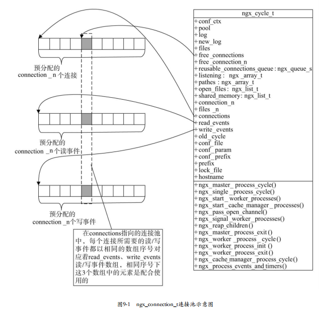
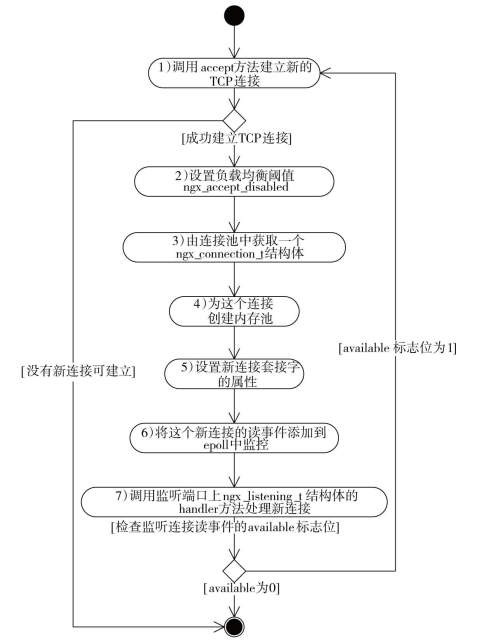

<!-- TOC -->

- [事件框架处理框架](#事件框架处理框架)
- [Nginx 的事件是什么](#nginx-的事件是什么)
- [nginx 的连接定义](#nginx-的连接定义)
    - [被动连接](#被动连接)
    - [主动连接](#主动连接)
    - [连接池](#连接池)
- [ngx_events_module 核心模块](#ngx_events_module-核心模块)
- [ngx_event_core_module 事件模块](#ngx_event_core_module-事件模块)
- [epoll事件驱动模块](#epoll事件驱动模块)
    - [epoll的原理和用法](#epoll的原理和用法)
    - [如何使用epoll](#如何使用epoll)
- [定时器事件](#定时器事件)
    - [缓存时间管理](#缓存时间管理)
    - [定时器的实现](#定时器的实现)
- [事件驱动框架的处理流程](#事件驱动框架的处理流程)
    - [如何建立新连接](#如何建立新连接)
    - [如何解决“惊群”问题](#如何解决惊群问题)
    - [如何实现负载均衡](#如何实现负载均衡)
    - [post事件队列](#post事件队列)
    - [ngx_process_events_and_timers流程](#ngx_process_events_and_timers流程)
        - [事件处理调用栈](#事件处理调用栈)
- [文件的异步IO](#文件的异步io)
- [TCP协议与Nginx](#tcp协议与nginx)
- [相关nginx 源码分析链接：](#相关nginx-源码分析链接)
- [相关测试代码:](#相关测试代码)
- [CMAKE相关：](#cmake相关)
- [几个问题：](#几个问题)

<!-- /TOC -->
<a id="markdown-事件框架处理框架" name="事件框架处理框架"></a>
## 事件框架处理框架

nginx事件模块可以理解为整个Nginx的引擎，他负责收集、管理、分发事件，Nginx事件主要分为两大类 网络事件和定时器事件

由于Nginx的移植性，他针对不同操作系统，相同操作系统的不同版本，分别实现了相应的事件模块实现。

- ngx_epoll_module  linux 2.6之后
- ngx_kqueue_module
- ngx_poll_module
- ngx_select_module
- ngx_devpoll_module
- ngx_eventport_module
- ngx_aio_module
- ngx_rtsig_module
- Windows的ngx_select_module模块

在ngx_event_core_module模块的初始化过程中，将会从以上9个模块中选取1个作为Nginx进程的事件驱动模块。
相关的有10个动作方法
```c
//ngx_event_module_t中的actions成员是定义事件驱动模块的核心方法，下面重点看一下actions中的这10个抽象方法
typedef struct {
    /* 
    添加事件方法，它将负责把1个感兴趣的事件添加到操作系统提供的事件驱动机制（如epoll、
    kqueue等）中，这样，在事件发生后，将可以在调用下面的process_events时获取这个事件 
    */
    ngx_int_t  (*add)(ngx_event_t *ev, ngx_int_t event, ngx_uint_t flags); //ngx_add_event中执行

    /*
    删除事件方法，它将把1个已经存在于事件驱动机制中的事件移除，这样以后即使这个事件发生，调用
   process_events方法时也无法再获取这个事件
    */
    ngx_int_t  (*del)(ngx_event_t *ev, ngx_int_t event, ngx_uint_t flags); //ngx_del_event中执行

    /*
     启用1个事件，目前事件框架不会调用这个方法，大部分事件驱动模块对于该方法的实现都是与上面的add方法完全一致的
     */
    ngx_int_t  (*enable)(ngx_event_t *ev, ngx_int_t event, ngx_uint_t flags);

    //禁用1个事件，目前事件框架不会调用这个方法，大部分事件驱动模块对于该方法的实现都是与上面的del方法完全一致的
    ngx_int_t  (*disable)(ngx_event_t *ev, ngx_int_t event, ngx_uint_t flags);

    //向事件驱动机制中添加一个新的连接，这意味着连接上的读写事件都添加到事件驱动机制中了
    ngx_int_t  (*add_conn)(ngx_connection_t *c); //ngx_add_conn中执行
    //从事件驱动机制中移除一个连接的读写事件
    ngx_int_t  (*del_conn)(ngx_connection_t *c, ngx_uint_t flags); //ngx_del_conn中执行

    ngx_int_t  (*notify)(ngx_event_handler_pt handler); //ngx_notify中执行

    //在正常的工作循环中，将通过调用process_event方法来处理事件。
    ngx_int_t  (*process_events)(ngx_cycle_t *cycle, ngx_msec_t timer,
                   ngx_uint_t flags); //调用见ngx_process_events

    //初始化事件驱动模块的方法
    ngx_int_t  (*init)(ngx_cycle_t *cycle, ngx_msec_t timer); //ngx_event_process_init中执行
    //退出事件驱动模块前调用的方法
    void       (*done)(ngx_cycle_t *cycle);  //ngx_done_events中执行
} ngx_event_actions_t;
```

<a id="markdown-nginx-的事件是什么" name="nginx-的事件是什么"></a>
## Nginx 的事件是什么

在Nginx中，每一个事件都由ngx_event_s结构体来表示

1. ngx_event_s可以是普通的epoll读写事件(参考ngx_event_connect_peer->ngx_add_conn或者ngx_add_event)，通过读写事件触发
2. 也可以是普通定时器事件(参考ngx_cache_manager_process_handler->ngx_add_timer(ngx_event_add_timer))，通过ngx_process_events_and_timers中的epoll_wait返回，可以是读写事件触发返回，也可能是因为没获取到共享锁，从而等待0.5s返回重新获取锁来跟新事件并执行超时事件来跟新事件并且判断定时器链表中的超时事件，超时则执行从而指向event的handler，然后进一步指向对应r或者u的->write_event_handler  read_event_handler
3. 也可以是利用定时器expirt实现的读写事件(参考ngx_http_set_write_handler->ngx_add_timer(ngx_event_add_timer)),触发过程见2，只是在handler中不会执行write_event_handler  read_event_handler一个ngx_connection_s对应一个ngx_event_s read和一个ngx_event_s write,其中事件的fd是从ngx_connection_s->fd获取，他们在ngx_worker_process_init->ngx_event_process_init中关联起来

<a id="markdown-nginx-的连接定义" name="nginx-的连接定义"></a>
## nginx 的连接定义

作为Web服务器，每一个用户请求至少对应着一个TCP连接，为了及时处理这个连接，至少需要一个读事件和一个写事件，使得epoll可以有效地根据触发的事件调度相应模块读取请求或者发送响应。因此，Nginx中定义了基本的数据结构ngx_connection_t来表示连接，这个连接表示是客户端主动发起的、Nginx服务器被动接受的TCP连接，我们可以简单称其为被动连接。同时，在有些请求的处理过程中，Nginx会试图主动向其他上游服务器建立连接，并以此连接与上游服务器通信，因此，这样的连接与ngx_connection_t又是不同的，Nginx定义了ngx_peer_connection_t结构体来表示主动连接，当然，ngx_peer_connection_t主动连接是以ngx_connection_t结构体为基础实现的。同时需要注意的是，这两种连接都不可以随意创建，必须从连接池中获取

<a id="markdown-被动连接" name="被动连接"></a>
### 被动连接 
客户端连接nginx，对应的数据结构是ngx_connection_s

<a id="markdown-主动连接" name="主动连接"></a>
### 主动连接

nginx连接后端服务器，对应的数据结构是ngx_peer_connection_s；主动连接是对被动连接的封装，每当事件消费者模块使用主动连接对象时，同被动连接一样也是从连接池中取出一个ngx_connection_t，再加上上游server名，socket地址等信息构成一个ngx_peer_connection_t结构体。

<a id="markdown-连接池" name="连接池"></a>
### 连接池

为了提高Nginx的访问速度，Nginx使用了连接池。连接池是一个数组，里面预先分配了很多个(根据配置文件的配置)ngx_connection_s结构。

当有客户端请求连接时，就从该数组中找到一个没有使用的ngx_connection_s，用来连接用户。

当用户close时，Nginx并没有释放掉这些数组，而是标记为可连接，然后等待下个客户端的连接。



连接池操作方法名|参数含义|执行意义|
---------------|-------|--------
|ngx_connection_t *ngx_get_connection(ngx_socket_t s,ngx_log_t *log)|s 是这条连接的套接字句柄，log则是记录日志 | 从连接池中获取一个ngx_connection_t结构体，同时获取相应的读事件/写事件
|void ngx_free_connection(ngx_connection_t *c)|c 是需要回收的连接|将这个连接回收到连接池中


<a id="markdown-ngx_events_module-核心模块" name="ngx_events_module-核心模块"></a>
## ngx_events_module 核心模块

ngx_events_module模块是一个核心模块，它定义了一类新模块： 事件模块。它的功能：
- 定义新的事件类型
- 定义每个事件模块都需要实现的ngx_event_module_t接口
- 管理这些事件模块生成的配置项结构体，并解析事件类配置项
- 在解析配置项时会调用其在ngx_command_t数组中定义的回调方法

<a id="markdown-ngx_event_core_module-事件模块" name="ngx_event_core_module-事件模块"></a>
## ngx_event_core_module 事件模块

ngx_event_core_module模块是一个事件类型的模块，它在所有事件模块中的顺序是第一位（configure执行时必须把它放在其他事件模块之前）。这就保证了它会先于其他事件模块执行，由此它选择事件驱动机制的任务才可以完成。ngx_event_core_module模块要完成哪些任务呢？ 它会创建连接池（包括读/写事件），同时会决定究竟使用哪些事件驱动机制，以及初始化将要使用的事件模块。

<a id="markdown-epoll事件驱动模块" name="epoll事件驱动模块"></a>
## epoll事件驱动模块

<a id="markdown-epoll的原理和用法" name="epoll的原理和用法"></a>
### epoll的原理和用法

有100万用户同时与一个进程保持着TCP连接，而每一时刻只有几十个或几百个TCP连接是活跃的（接收到TCP包），也就是说，在每一时刻，进程只需要处理这100万连接中的一小部分连接。 那么，如何才能高效地处理这种场景呢？ 进程是否在每次询问操作系统收集有事件发生的TCP连接时，把这100万个连接告诉操作系统，然后由操作系统找出其中有事件发生的几百个连接呢？ 实际上，在Linux内核2.4版本以前，那时的select或者poll事件驱动方式就是这样做的。

这里有个非常明显的问题，即在某一时刻，进程收集有事件的连接时，其实这100万连接中的大部分都是没有事件发生的。 因此，如果每次收集事件时，都把这100万连接的套接字传给操作系统（这首先就是用户态内存到内核态内存的大量复制） ，而由操作系统内核寻找这些连接上有没有未处理的事件，将会是巨大的资源浪费，然而select和poll就是这样做的，因此它们最多只能处理几千个并发连接。 而epoll不这样做，它在Linux内核中申请了一
个简易的文件系统，把原先的一个select或者poll调用分成了3个部分：
- 调用epoll_create建立1个epoll对象（在epoll文件系统中给这个句柄分配资源）
- 调用epoll_ctl向epoll对象中添加这100万个连接的套接字
- 调用epoll_wait收集发生事件的连接

这样，只需要在进程启动时建立1个epoll对象，并在需要的时候向它添加或删除连接就可以了，因此，在实际收集事件时，epoll_wait的效率就会非常高，因为调用epoll_wait时并没有向它传递这100万个连接，内核也不需要去遍历全部的连接。

epoll 在内核实现了两个重要的数据结构，
- 红黑树 [存放所有待监听的连接的socket fd]
- 双向链表 [就绪的，有事件触发的socket fd]

而 epoll_wait检查是否有发生事件的连接时，只是检查eventpoll对象中的rdllist双向链表是否有epitem元素而已，如果rdllist链表不为空，则把这里的事件复制到用户态内存中，同时将事件数量返回给用户。 因此，epoll_wait的效率非常高。 epoll_ctl在向epoll对象中添加、 修改、 删除事件时，从rbr红黑树中查找事件也非常快，也就是说，epoll是非常高效的，它可以轻易地处理百万级别的并发连接。

<a id="markdown-如何使用epoll" name="如何使用epoll"></a>
### 如何使用epoll

```c
#include <sys/epoll.h>
/*
    创建一个epoll的句柄，size用来告诉内核这个监听的数目一共有多大。
*/
int epoll_create(int size);
/*
epfd: 
    epoll_create创建的fd
fd:
    需要监听的fd
op 参数可选:
    EPOLL_CTL_ADD：注册新的fd到epfd中
    EPOLL_CTL_MOD：修改已经注册的fd的监听事件
    EPOLL_CTL_DEL：从epfd中删除一个fd

event告诉内核需要监听什么事件:
    struct epoll_event {
        __uint32_t events;  // Epoll events
        epoll_data_t data;  // User data variable
    };
    typedef union epoll_data {
        void *ptr;
        int fd;
        __uint32_t u32;
        __uint64_t u64;
    } epoll_data_t;

event 的几个宏:
    EPOLLIN ：表示对应的文件描述符可以读（包括对端SOCKET正常关闭）
    EPOLLOUT：表示对应的文件描述符可以写
    EPOLLPRI：表示对应的文件描述符有紧急的数据可读（这里应该表示有带外数据到来）
    EPOLLERR：表示对应的文件描述符发生错误
    EPOLLHUP：表示对应的文件描述符被挂断
    EPOLLET： 将EPOLL设为边缘触发(Edge Triggered)模式，这是相`对于水平触发(Level Triggered)来说的
    EPOLLONESHOT：只监听一次事件，当监听完这次事件之后，如果还需要继续监听这个socket的话，需要再次把这个socket加入到EPOLL队列里
*/
int epoll_ctl(int epfd, int op, int fd, struct epoll_event *event);
/*
    参数events用来从内核得到事件的集合
    maxevents告之内核这个events有多大，这个maxevents的值不能大于创建epoll_create()时的size
    参数timeout是超时时间（毫秒，0会立即返回，-1将不确定，也有说法说是永久阻塞）。该函数返回需要处理的事件数目，如返回0表示已超时。
*/
int epoll_wait(int epfd, struct epoll_event * events, int maxevents, int timeout);
```

工作模式：

LT(level trigger)和ET(edge trigger)。LT模式是默认模式，LT模式与ET模式的区别如下：

- LT模式：当epoll_wait检测到描述符事件发生并将此事件通知应用程序，应用程序可以不立即处理该事件。下次调用epoll_wait时，会再次响应应用程序并通知此事件。
- ET模式：当epoll_wait检测到描述符事件发生并将此事件通知应用程序，应用程序必须立即处理该事件。如果不处理，下次调用epoll_wait时，不会再次响应应用程序并通知此事件。
- ET模式在很大程度上减少了epoll事件被重复触发的次数，因此效率要比LT模式高。epoll工作在ET模式的时候，必须使用非阻塞套接口，以避免由于一个文件句柄的阻塞读/阻塞写操作把处理多个文件描述符的任务饿死。

二者的主要差异在于level-trigger模式下只要某个socket处于readable/writable状态，无论什么时候进行epoll_wait都会返回该socket；而edge-trigger模式下只有某个socket从unreadable变为readable或从unwritable变为writable时，epoll_wait才会返回该socket。

<a id="markdown-定时器事件" name="定时器事件"></a>
## 定时器事件

Nginx实现了自己的定时器触发机制，它与epoll等事件驱动模块处理的网络事件不同：在网络事件中，网络事件的触发是由内核完成的，内核如果支持epoll就可以使用ngx_epoll_module模块驱动事件，内核如果仅支持select那就得使用ngx_select_module模块驱动事件； 定时器事件则完全是由Nginx自身实现的，它与内核完全无关。

<a id="markdown-缓存时间管理" name="缓存时间管理"></a>
### 缓存时间管理

gettimeofday()函数和localtime()函数等，大部分函数本质上都是通过系统调用来获取时间的。但是使用系统调用时，有一个问题需要特别关注，就是系统调用开销的问题。
Nginx服务器重视程序的高效运行，Nginx程序采取缓存时间的方法来减少对gettimeofday()的调用，并且每个工作进程会自行维护时间缓存。Nginx的时间缓存一般会赋值给一下四种变量，更新缓存时是同步更新的。

Nginx服务器更新时间缓存的两个函数是ngx_time_update()和ngx_time_sigsafe_update()，具体的实现的源码都在/nginx/src/core/ngx_time.c中可以找到。我们分别来分析一下它们的源码。

<a id="markdown-定时器的实现" name="定时器的实现"></a>
### 定时器的实现

定时器是通过一棵红黑树实现的。 ngx_event_timer_rbtree就是所有定时器事件组成的红黑树，而ngx_event_timer_sentinel就是这棵红黑树的哨兵节点，如下所示。

`ngx_thread_volatile ngx_rbtree_t ngx_event_timer_rbtree; static ngx_rbtree_node_t ngx_event_timer_sentinel;`

这棵红黑树中的每个节点都是ngx_event_t事件中的timer成员，而ngx_rbtree_node_t节点的关键字就是事件的超时时间，以这个超时时间的大小组成了二叉排序树ngx_event_timer_rbtree。 这样，如果需要找出最有可能超时的事件，那么将ngx_event_timer_rbtree树中最左边的节点取出来即可。 只要用当前时间去比较这个最左边节点的超时时间，就会知道这个事件有没有触发超时，如果还没有触发超时，那么会知道最少还要经过多少毫秒满足超时条件而触发超时。

<a id="markdown-事件驱动框架的处理流程" name="事件驱动框架的处理流程"></a>
## 事件驱动框架的处理流程

多个子进程争抢处理一个新连接事件时，一定只有一个worker子进程最终会成功建立连接，随后，它会一直处理这个连接直到连接关闭。 那么，如果有的子进程很“勤奋”，它们抢着建立并处理了大部分连接，而有的子进程则“运气不好”，只处理了少量连接，这对多核CPU架构下的应用是很不利的，因为子进程间应该是平等的，每个子进程应该尽量地独占一个CPU核心。 子进程间负载不均衡，必然影响整个服务的性能。 

上述问题的解决离不开Nginx的post事件处理机制。 这个post事件是什么意思呢？ 它表示允许事件延后执行。 Nginx设计了两个post队列，一个是由被触发的监听连接的读事件构成的ngx_posted_accept_events队列，另一个是由普通读/写事件构成的ngx_posted_events队列。 这样的post事件可以让用户完成什么样的功能呢

将epoll_wait产生的一批事件，分到这两个队列中，让存放着新连接事件的ngx_posted_accept_events队列优先执行，存放普通事件的ngx_posted_events队列最后执行，这是解决“惊群” 和负载均衡两个问题的关键。如果在处理一个事件的过程中产生了另一个事件，而我们希望这个事件随后执行（不是立刻执行） ，就可以把它放到post队列中。

<a id="markdown-如何建立新连接" name="如何建立新连接"></a>
### 如何建立新连接



1. 首先调用accept方法试图建立新连接，如果没有准备好的新连接事件，ngx_event_accept方法会直接返回。
2. 设置负载均衡阈值ngx_accept_disabled，这个阈值是进程允许的总连接数的1/8减去空闲连接数
3. 调用ngx_get_connection方法由连接池中获取一个ngx_connection_t连接对象。
4. 为ngx_connection_t中的pool指针建立内存池。 在这个连接释放到空闲连接池时，释放pool内存池。
5. 设置套接字的属性，如设为非阻塞套接字。
6. 将这个新连接对应的读事件添加到epoll等事件驱动模块中，这样，在这个连接上如果接收到用户请求epoll_wait，就会收集到这个事件。
7. 调用监听对象ngx_listening_t中的handler回调方法。 ngx_listening_t结构体的handler回调方法就是当新的TCP连接刚刚建立完成时在这里调用的。

最后，如果监听事件的available标志位为1，再次循环到第1步，否则ngx_event_accept方法结束。 事件的available标志位对应着multi_accept配置项。 当available为1时，告诉Nginx一次性尽量多地建立新连接，它的实现原理也就在这里。

<a id="markdown-如何解决惊群问题" name="如何解决惊群问题"></a>
### 如何解决“惊群”问题

只有打开了accept_mutex锁，才可以解决“惊群”问题。 何谓“惊群”？ 就像上面说过的那样，master进程开始监听Web端口，fork出多个worker子进程，这些子进程开始同时监听同一个Web端口。 一般情况下，有多少CPU核心，就会配置多少个worker子进程，这样所有的worker子进程都在承担着Web服务器的角色。 在这种情况下，就可以利用每一个CPU核心可以并发工作的特性，充分发挥多核机器的“威力”。 但下面假定这样一个场景： 没有用户连入服务器，某一时刻恰好所有的worker子进程都休眠且等待新连接的系统调用（如epoll_wait） ，这时有一个用户向服务器发起了连接，内核在收到TCP的SYN包时，会激活所有的休眠worker子进程，当然，此时只有最先开始执行accept的子进程可以成功建立新连接，而其他worker子进程都会accept失败。 这些accept失败的子进程被内核唤醒是不必要的，它们被唤醒后的执行很可能也是多余的，那么这一时刻它们占用了本不需要占用的系统资源，引发了不必要的进程上下文切换，增加了系统开销。

也许很多操作系统的最新版本的内核已经在事件驱动机制中解决了“惊群”问题，但Nginx作为可移植性极高的Web服务器，还是在自身的应用层面上较好地解决了这一问题。 既然“惊群”是多个子进程在同一时刻监听同一个端口引起的，那么Nginx的解决方式也很简单，它规定了同一时刻只能有唯一一个worker子进程监听Web端口，这样就不会发生“惊群”了，此时新连接事件只能唤醒唯一正在监听端口的worker子进程。

ngx_accept_mutex实际上是Nginx进程间的同步锁。 第14章我们会详细介绍进程间的同步方式，目前只需要清楚ngx_shmtx_trylock方法是一个非阻塞的获取锁的方法即可。 如果成功获取到锁，则返回1，否则返回0。 ngx_shmtx_unlock方法负责释放锁。 ngx_accept_mutex_held是当前进程的一个全局变量，如果为1，则表示这个进程已经获取到了ngx_accept_mutex锁； 如果为0，则表示没有获取到锁，这个标志位主要用于进程内各模块了解是否获取到了ngx_accept_mutex锁，具体定义如下所示。
```c
ngx_shmtx_t ngx_accept_mutex;
ngx_uint_t ngx_accept_mutex_held;
```

因此，在调用ngx_trylock_accept_mutex方法后，要么是唯一获取到ngx_accept_mutex锁且其epoll等事件驱动模块开始监控Web端口上的新连接事件，要么是没有获取到锁，当前进程不会收到新连接事件。
如果ngx_trylock_accept_mutex方法没有获取到锁，接下来调用事件驱动模块的process_events方法时只能处理已有的连接上的事件； 如果获取到了锁，调用process_events方法时就会既处理已有连接上的事件，也处理新连接的事件。 这样的话，问题又来了，什么时候释放ngx_accept_mutex锁呢？ 等到这批事件全部执行完吗？ 这当然是不可取的，因为这个worker进程上可能有许多活跃的连接，处理这些连接上的事件会占用很长时间，也就是说，会有很长时间都没有释放ngx_accept_mutex锁，这样，其他worker进程就很难得到处理新连接的机会。

如何解决长时间占用ngx_accept_mutex锁的问题呢？ 这就要依靠ngx_posted_accept_events队列和ngx_posted_events队列了。

调用ngx_trylock_accept_mutex试图处理监听端口的新连接事件，如果ngx_accept_mutex_held为1，就表示开始处理新连接事件了，这时将flags标志位加上NGX_POST_EVENTS。 这里的flags是在9.6.3节中列举的ngx_epoll_process_events方法中的第3个参数flags。 当flags标志位包含NGX_POST_EVENTS时是不会立刻调用事件的handler回调方法的；

对于写事件，也可以采用同样的处理方法。 实际上，ngx_posted_accept_events队列和ngx_posted_events队列把这批事件归类了，即新连接事件全部放到ngx_posted_accept_events队列中，普通事件则放到ngx_posted_events队列中。 这样，接下来会先处理ngx_posted_accept_events队列中的事件，处理完后就要立刻释放ngx_accept_mutex锁，接着再处理ngx_posted_events队列中的事件，这样就大大减少了ngx_accept_mutex锁占用的时间。

<a id="markdown-如何实现负载均衡" name="如何实现负载均衡"></a>
### 如何实现负载均衡

与“惊群”问题的解决方法一样， 只有打开了accept_mutex锁， 才能实现worker子进程间的负载均衡。 在图9-6的第2步中， 初始化了一个全局变量ngx_accept_disabled， 它就是负载均衡机制实现的关键阈值， 实际上它就是一个整型数据。
`ngx_int_t ngx_accept_disabled;`
这个阈值是与连接池中连接的使用情况密切相关的， 在图上图的第2步中它会进行赋值，如下所示。

`ngx_accept_disabled = ngx_cycle->connection_n/8 - ngx_cycle->free_connection_n;`

因此， 在Nginx启动时， ngx_accept_disabled的值就是一个负数， 其值为连接总数的7/8。其实，ngx_accept_disabled的用法很简单， 当它为负数时， 不会进行触发负载均衡操作； 而当ngx_accept_disabled是正数时， 就会触发Nginx进行负载均衡操作了。 Nginx的做法也很简单， 就是当ngx_accept_disabled是正数时当前进程将不再处理新连接事件， 取而代之的仅仅是ngx_accept_disabled值减1， 如下所示。

```c
    ngx_accept_disabled = ngx_cycle->connection_n/8 - ngx_cycle->free_connection_n;
    if (ngx_accept_disabled > 0) {
        ngx_accept_disabled--;
    } else {
        if (ngx_trylock_accept_mutex(cycle) == NGX_ERROR) {
        return;
    }    
```
上面这段代码表明， 在当前使用的连接到达总连接数的7/8时， 就不会再处理新连接了， 同时， 在每次调用process_events时都会将ngx_accept_disabled减1， 直到ngx_accept_disabled降到总连接数的7/8以下时， 才会调用ngx_trylock_accept_mutex试图去处理新连接事件。因此， Nginx各worker子进程间的负载均衡仅在某个worker进程处理的连接数达到它最大处理总数的7/8时才会触发， 这时该worker进程就会减少处理新连接的机会， 这样其他较空闲的worker进程就有机会去处理更多的新连接， 以此达到整个Web服务的均衡处理效果。 虽然这样的机制不是很完美， 但在维护一定程度上的负载均衡时， 很好地避免了当某个worker进程由于连接池耗尽而拒绝服务， 同时， 在其他worker进程上处理的连接还远未达到上限的问题。 因此， Nginx将accept_mutex配置项默认设为accept_mutex on。

<a id="markdown-post事件队列" name="post事件队列"></a>
### post事件队列

下面是两个
post事件队列的定义：
```c
ngx_thread_volatile ngx_event_t ngx_posted_accept_events;
ngx_thread_volatile ngx_event_t ngx_posted_events;
```

这两个指针都指向事件队列中的首个事件。 这些事件间是以双向链表的形式组织成post事件队列的。 注意， ngx_event_t结构体的next和prev成员仅用于post事件队列。
对于post事件队列的操作方法共有4个：

post事件队列的操作方法

方法名|参数含义|执行意义|
------|-------|--------
ngx_locked_post_event(ev,queue)|ev是要添加到post事件队列的事件，queue是post事件队列 | 向queue事件队列中添加事件ev，注意，ev将插入到事件队列的首部|
ngx_post_event(ev, queue)| ev是要添加到post事件队列的事件，queue是post事件队列| 线程安全地向queue事件队列中添加事件ev。在目前不使用多线程的情况下，它与ngx_locked_post_event的功能是相同的|
ngx_delete_posted_event(ev)|ev是要从某个post事件队列移除的事件|将事件ev从其所属的post事件队列中删除|
void ngx_event_process_posted (ngx_cycle_t *cycle,ngx_thread_volatile ngx_event_t **posted);|cycle是进程的核心结构体ngx_cycle_t的指针．posted是要操作的post事件队列，它的取值目前仅可以为ngx_posted_events或者ngx_posted_accept_events|调用用posted事件队列中所有事件的handler回调方法。每个事件调用完handler方法后，就会从posted事件队列中删除

<a id="markdown-ngx_process_events_and_timers流程" name="ngx_process_events_and_timers流程"></a>
### ngx_process_events_and_timers流程

详见代码 src/event/ngx_event.c

<a id="markdown-事件处理调用栈" name="事件处理调用栈"></a>
#### 事件处理调用栈

[`main`](https://github.com/y123456yz/reading-code-of-nginx-1.9.2/blob/d4211403a022a275dd8ed68530353a5df7a12a5c/nginx-1.9.2/src/core/nginx.c) ->
[`ngx_process_cycle`](https://github.com/y123456yz/reading-code-of-nginx-1.9.2/blob/d4211403a022a275dd8ed68530353a5df7a12a5c/nginx-1.9.2/src/os/unix/ngx_process_cycle.c) ->
[`ngx_process_events_and_timers`](https://github.com/y123456yz/reading-code-of-nginx-1.9.2/blob/263528f9eb458cfd6ba4f83e40ea2bf8b2e4b2f6/nginx-1.9.2/src/event/ngx_event.c)

每个worker进程都在ngx_worker_process_cycle方法中循环处理事件。 在处理分发事件实际上就是调用的ngx_process_events_and_timers方法， 下面先看一下它的定义：

`void ngx_process_events_and_timers(ngx_cycle_t *cycle);`

循环调用ngx_process_events_and_timers方法就是在处理所有的事件， 这正是事件驱动机制的核心。 顾名思义， ngx_process_events_and_timers方法既会处理普通的网络事件， 也会处
理定时器事件，ngx_process_events_and_timers方法中核心的操作主要有以下3个：
- 调用所使用的事件驱动模块实现的process_events方法， 处理网络事件。
- 处理两个post事件队列中的事件， 实际上就是分别调用
    - ngx_event_process_posted(cycle,&ngx_posted_accept_events)
    - ngx_event_process_posted(cycle,&ngx_posted_events) 方法
- 处理定时器事件， 实际上就是调用ngx_event_expire_timers() 方法

<a id="markdown-文件的异步io" name="文件的异步io"></a>
## 文件的异步IO

<a id="markdown-tcp协议与nginx" name="tcp协议与nginx"></a>
## TCP协议与Nginx


<a id="markdown-相关nginx-源码分析链接" name="相关nginx-源码分析链接"></a>
## 相关nginx 源码分析链接：

[reading-code-of-nginx-1.9.2](https://github.com/y123456yz/reading-code-of-nginx-1.9.2)  **`极力推荐`**

[Nginx 内核源码解析](https://techlog.cn/article/list/10182612)

[理解 Nginx 源码](https://www.kancloud.cn/digest/understandingnginx/202586)

[Nginx 中文官方手册](http://www.shouce.ren/api/view/a/13430)

[Tengine](http://tengine.taobao.org/book/)

[Nginx三大模块--核心模块](https://www.myfreax.com/nginx-core-module-introduction/#0)

[Nginx vs. Tengine](https://w3techs.com/technologies/comparison/ws-nginx,ws-tengine)

[信号之sigsuspend函数](https://www.cnblogs.com/nufangrensheng/p/3516427.html)

<a id="markdown-相关测试代码" name="相关测试代码"></a>
## 相关测试代码:

[nginx_simulator](https://github.com/skybosi/some-tips/tree/master/nginx_simulator)

[epoll_test](https://github.com/skybosi/some-tips/tree/master/epoll_test)

[socketpair](https://github.com/skybosi/some-tips/blob/master/nginx_simulator/src/sockerpair.c)

<a id="markdown-cmake相关" name="cmake相关"></a>
## CMAKE相关：

[CMAKE官网](https://cmake.org/)

[CMAKE模板1](https://www.cnblogs.com/tla001/p/6827808.html)

[CMAKE模板2](https://github.com/skybosi/some-tips/blob/master/nginx_simulator/CMakeLists.txt)

<a id="markdown-几个问题" name="几个问题"></a>
## 几个问题：

1. linux是怎么管理进程号的？
2. epoll 支持非socket fd 事件监控吗？
