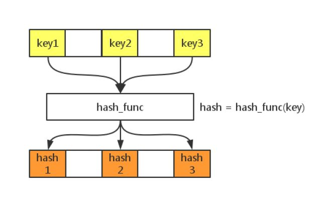
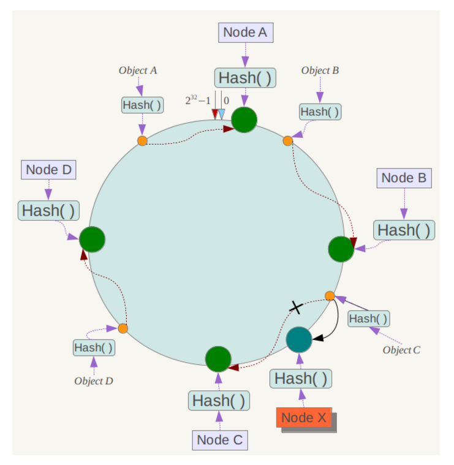
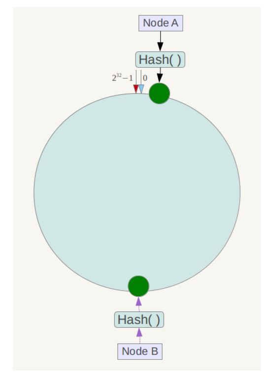

<!-- TOC -->

- [场景描述](#场景描述)
- [一致性Hash算法背景](#一致性hash算法背景)
- [一致性Hash性质](#一致性hash性质)
- [原理](#原理)
    - [基本概念](#基本概念)

<!-- /TOC -->
# 一致性哈希

## 场景描述
假设，我们有三台缓存服务器，用于缓存图片，我们为这三台缓存服务器编号为0号、1号、2号，现在，有3万张图片需要缓存，我们希望这些图片被均匀的缓存到这3台服务器上，以便它们能够分摊缓存的压力。也就是说，我们希望每台服务器能够缓存1万张左右的图片，那么，我们应该怎样做呢？如果我们没有任何规律的将3万张图片平均的缓存在3台服务器上，可以满足我们的要求吗？可以！但是如果这样做，当我们需要访问某个缓存项时，则需要遍历3台缓存服务器，从3万个缓存项中找到我们需要访问的缓存，遍历的过程效率太低，时间太长，当我们找到需要访问的缓存项时，时长可能是不能被接受的，也就失去了缓存的意义，缓存的目的就是提高速度，改善用户体验，减轻后端服务器压力，如果每次访问一个缓存项都需要遍历所有缓存服务器的所有缓存项，想想就觉得很累，那么，我们该怎么办呢？原始的做法是对缓存项的键进行哈希，将hash后的结果对缓存服务器的数量进行取模操作，通过取模后的结果，决定缓存项将会缓存在哪一台服务器上，这样说可能不太容易理解，我们举例说明，仍然以刚才描述的场景为例，假设我们使用图片名称作为访问图片的key，假设图片名称是不重复的，那么，我们可以使用如下公式，计算出图片应该存放在哪台服务器上。
hash（图片名称）% N
因为图片的名称是不重复的，所以，当我们对同一个图片名称做相同的哈希计算时，得出的结果应该是不变的，如果我们有3台服务器，使用哈希后的结果对3求余，那么余数一定是0、1或者2，没错，正好与我们之前的服务器编号相同，如果求余的结果为0， 我们就把当前图片名称对应的图片缓存在0号服务器上，如果余数为1，就把当前图片名对应的图片缓存在1号服务器上，如果余数为2，同理，那么，当我们访问任意一个图片的时候，只要再次对图片名称进行上述运算，即可得出对应的图片应该存放在哪一台缓存服务器上，我们只要在这一台服务器上查找图片即可，如果图片在对应的服务器上不存在，则证明对应的图片没有被缓存，也不用再去遍历其他缓存服务器了，通过这样的方法，即可将3万张图片随机的分布到3台缓存服务器上了，而且下次访问某张图片时，直接能够判断出该图片应该存在于哪台缓存服务器上，这样就能满足我们的需求了，我们暂时称上述算法为HASH算法或者取模算法，取模算法的过程可以用下图表示。

但是，使用上述HASH算法进行缓存时，会出现一些缺陷，试想一下，如果3台缓存服务器已经不能满足我们的缓存需求，那么我们应该怎么做呢？没错，很简单，多增加两台缓存服务器不就行了，假设，我们增加了一台缓存服务器，那么缓存服务器的数量就由3台变成了4台，此时，如果仍然使用上述方法对同一张图片进行缓存，那么这张图片所在的服务器编号必定与原来3台服务器时所在的服务器编号不同，因为除数由3变为了4，被除数不变的情况下，余数肯定不同，这种情况带来的结果就是当服务器数量变动时，所有缓存的位置都要发生改变，换句话说，当服务器数量发生改变时，所有缓存在一定时间内是失效的，当应用无法从缓存中获取数据时，则会向后端服务器请求数据，同理，假设3台缓存中突然有一台缓存服务器出现了故障，无法进行缓存，那么我们则需要将故障机器移除，但是如果移除了一台缓存服务器，那么缓存服务器数量从3台变为2台，如果想要访问一张图片，这张图片的缓存位置必定会发生改变，以前缓存的图片也会失去缓存的作用与意义，由于大量缓存在同一时间失效，造成了缓存的雪崩，此时前端缓存已经无法起到承担部分压力的作用，后端服务器将会承受巨大的压力，整个系统很有可能被压垮，所以，我们应该想办法不让这种情况发生，但是由于上述HASH算法本身的缘故，使用取模法进行缓存时，这种情况是无法避免的，为了解决这些问题，一致性哈希算法诞生了。

我们来回顾一下使用上述算法会出现的问题。

问题1：当缓存服务器数量发生变化时，会引起缓存的雪崩，可能会引起整体系统压力过大而崩溃（大量缓存同一时间失效）。
问题2：当缓存服务器数量发生变化时，几乎所有缓存的位置都会发生改变，怎样才能尽量减少受影响的缓存呢？
其实，上面两个问题是一个问题，那么，一致性哈希算法能够解决上述问题吗？

## 一致性Hash算法背景

一致性哈希算法在1997年由麻省理工学院的Karger等人在解决分布式Cache中提出的，设计目标是为了解决因特网中的热点(Hot spot)问题，初衷和CARP十分类似。一致性哈希修正了CARP使用的简单哈希算法带来的问题，使得DHT可以在P2P环境中真正得到应用。

但现在一致性hash算法在分布式系统中也得到了广泛应用，研究过memcached缓存数据库的人都知道，memcached服务器端本身不提供分布式cache的一致性，而是由客户端来提供，具体在计算一致性hash时采用如下步骤：
1. 首先求出memcached服务器（节点）的哈希值，并将其配置到0～232的圆（continuum）上。
2. 然后采用同样的方法求出存储数据的键的哈希值，并映射到相同的圆上。
3. 然后从数据映射到的位置开始顺时针查找，将数据保存到找到的第一个服务器上。如果超过232仍然找不到服务器，就会保存到第一台memcached服务器上。

从上图的状态中添加一台memcached服务器。余数分布式算法由于保存键的服务器会发生巨大变化而影响缓存的命中率，但Consistent Hashing中，只有在园（continuum）上增加服务器的地点逆时针方向的第一台服务器上的键会受到影响，如下图所示：

## 一致性Hash性质

考虑到分布式系统每个节点都有可能失效，并且新的节点很可能动态的增加进来，如何保证当系统的节点数目发生变化时仍然能够对外提供良好的服务，这是值得考虑的，尤其实在设计分布式缓存系统时，如果某台服务器失效，对于整个系统来说如果不采用合适的算法来保证一致性，那么缓存于系统中的所有数据都可能会失效（即由于系统节点数目变少，客户端在请求某一对象时需要重新计算其hash值（通常与系统中的节点数目有关），由于hash值已经改变，所以很可能找不到保存该对象的服务器节点），因此一致性hash就显得至关重要，良好的分布式cahce系统中的一致性hash算法应该满足以下几个方面：

- 平衡性(Balance)
> 平衡性是指哈希的结果能够尽可能分布到所有的缓冲中去，这样可以使得所有的缓冲空间都得到利用。很多哈希算法都能够满足这一条件。

- 单调性(Monotonicity)
> 单调性是指如果已经有一些内容通过哈希分派到了相应的缓冲中，又有新的缓冲区加入到系统中，那么哈希的结果应能够保证原有已分配的内容可以被映射到新的缓冲区中去，而不会被映射到旧的缓冲集合中的其他缓冲区。简单的哈希算法往往不能满足单调性的要求，如最简单的线性哈希：x = (ax + b) mod (P)，在上式中，P表示全部缓冲的大小。不难看出，当缓冲大小发生变化时(从P1到P2)，原来所有的哈希结果均会发生变化，从而不满足单调性的要求。哈希结果的变化意味着当缓冲空间发生变化时，所有的映射关系需要在系统内全部更新。而在P2P系统内，缓冲的变化等价于Peer加入或退出系统，这一情况在P2P系统中会频繁发生，因此会带来极大计算和传输负荷。单调性就是要求哈希算法能够应对这种情况。

- 分散性(Spread)
> 在分布式环境中，终端有可能看不到所有的缓冲，而是只能看到其中的一部分。当终端希望通过哈希过程将内容映射到缓冲上时，由于不同终端所见的缓冲范围有可能不同，从而导致哈希的结果不一致，最终的结果是相同的内容被不同的终端映射到不同的缓冲区中。这种情况显然是应该避免的，因为它导致相同内容被存储到不同缓冲中去，降低了系统存储的效率。分散性的定义就是上述情况发生的严重程度。好的哈希算法应能够尽量避免不一致的情况发生，也就是尽量降低分散性。

- 负载(Load)
> 负载问题实际上是从另一个角度看待分散性问题。既然不同的终端可能将相同的内容映射到不同的缓冲区中，那么对于一个特定的缓冲区而言，也可能被不同的用户映射为不同的内容。与分散性一样，这种情况也是应当避免的，因此好的哈希算法应能够尽量降低缓冲的负荷。

- 平滑性(Smoothness)
> 平滑性是指缓存服务器的数目平滑改变和缓存对象的平滑改变是一致的。

## 原理

### 基本概念

一致性哈希算法（Consistent Hashing）最早在论文[《Consistent Hashing and Random Trees: Distributed Caching Protocols for Relieving Hot Spots on the World Wide Web》](./一致性哈希.pdf)中被提出。简单来说，一致性哈希将整个哈希值空间组织成一个虚拟的圆环，如假设某哈希函数H的值空间为0-2^32-1（即哈希值是一个32位无符号整形），整个哈希空间环如下：

整个空间按顺时针方向组织。0和2^32-1在零点中方向重合。
下一步将各个服务器使用Hash进行一个哈希，具体可以选择服务器的ip或主机名作为关键字进行哈希，这样每台机器就能确定其在哈希环上的位置，这里假设将上文中四台服务器使用ip地址哈希后在环空间的位置如下：

接下来使用如下算法定位数据访问到相应服务器：将数据key使用相同的函数Hash计算出哈希值，并确定此数据在环上的位置，从此位置沿环顺时针"行走"，第一台遇到的服务器就是其应该定位到的服务器。
例如我们有Object A、Object B、Object C、Object D四个数据对象，经过哈希计算后，在环空间上的位置如下：

根据一致性哈希算法，数据A会被定为到Node A上，B被定为到Node B上，C被定为到Node C上，D被定为到Node D上。
下面分析一致性哈希算法的容错性和可扩展性。现假设Node C不幸宕机，可以看到此时对象A、B、D不会受到影响，只有C对象被重定位到Node D。一般的，在一致性哈希算法中，如果一台服务器不可用，则受影响的数据仅仅是此服务器到其环空间中前一台服务器（即沿着逆时针方向行走遇到的第一台服务器）之间数据，其它不会受到影响。
下面考虑另外一种情况，如果在系统中增加一台服务器Node X，如下图所示：

此时对象Object A、B、D不受影响，只有对象C需要重定位到新的Node X 。一般的，在一致性哈希算法中，如果增加一台服务器，则受影响的数据仅仅是新服务器到其环空间中前一台服务器（即沿着逆时针方向行走遇到的第一台服务器）之间数据，其它数据也不会受到影响。
综上所述，一致性哈希算法对于节点的增减都只需重定位环空间中的一小部分数据，具有较好的容错性和可扩展性。
另外，一致性哈希算法在服务节点太少时，容易因为节点分部不均匀而造成数据倾斜问题。例如系统中只有两台服务器，其环分布如下，

此时必然造成大量数据集中到Node A上，而只有极少量会定位到Node B上。为了解决这种数据倾斜问题，一致性哈希算法引入了虚拟节点机制，即对每一个服务节点计算多个哈希，每个计算结果位置都放置一个此服务节点，称为虚拟节点。具体做法可以在服务器ip或主机名的后面增加编号来实现。例如上面的情况，可以为每台服务器计算三个虚拟节点，于是可以分别计算 "Node A#1"、"Node A#2"、"Node A#3"、"Node B#1"、"Node B#2"、"Node B#3"的哈希值，于是形成六个虚拟节点：

同时数据定位算法不变，只是多了一步虚拟节点到实际节点的映射，例如定位到"Node A#1"、"Node A#2"、"Node A#3"三个虚拟节点的数据均定位到Node A上。这样就解决了服务节点少时数据倾斜的问题。在实际应用中，通常将虚拟节点数设置为32甚至更大，因此即使很少的服务节点也能做到相对均匀的数据分布。
