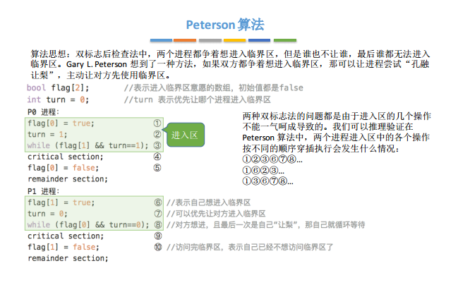
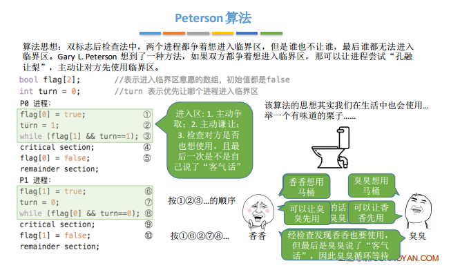
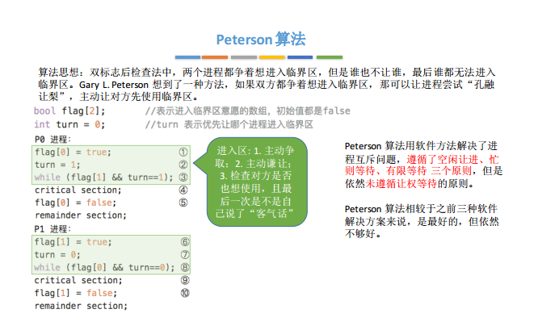

<!-- TOC -->

- [什么是互斥](#什么是互斥)
- [竞态](#竞态)
    - [产生竞态的条件](#产生竞态的条件)
    - [产生竞态的情况](#产生竞态的情况)
- [互斥原则](#互斥原则)
- [实现互斥的方法](#实现互斥的方法)
    - [软件实现方法](#软件实现方法)
    - [硬件实现方法](#硬件实现方法)

<!-- /TOC -->

<a id="markdown-什么是互斥" name="什么是互斥"></a>
## 什么是互斥

两个或两个以上的进程，不能同时进入关于同一组共享变量的临界区域，否则可能发生与时间有关的错误，这种现象被称作进程互斥· 也就是说，一个进程正在访问临界资源，另一个要访问该资源的进程必须等待。

在多道程序环境下，存在着临界资源，它是指多进程存在时必须互斥访问的资源。也就是某一时刻不允许多个进程同时访问，只能单个进程的访问。我们把这些程序的片段称作临界区或临界段，它存在的目的是有效的防止竞争条件又能保证最大化使用共享数据。而这些并发进程必须有好的解决方案，才能防止出现以下情况：多个进程同时处于临界区，临界区外的进程阻塞其他的进程，有些进程在临界区外无休止的等待。除此以外，这些方案还不能对CPU的速度和数目做出任何的假设。只有满足了这些条件，才是一个好的解决方案。

<a id="markdown-竞态" name="竞态"></a>
## 竞态

在并发编程中，这种由于不恰当的执行时序而出现不正确的结果是一种非常严重的情况，它有一个正式的名字叫做：竞态条件；而产生的这种现象叫做竞态

<a id="markdown-产生竞态的条件" name="产生竞态的条件"></a>
### 产生竞态的条件

- 多个进程或线程
- 共享的资源

<a id="markdown-产生竞态的情况" name="产生竞态的情况"></a>
### 产生竞态的情况

- 读与写： 没有写入或正在写入 就去读；正在读的时候被写；这两种情况都会导致读出的数据不正确
- 条件与执行（检测与动作）：检测满足条件才能执行动作；但是由于多进程下没有控制进入的时机，导致执行时条件不满足。

<a id="markdown-互斥原则" name="互斥原则"></a>
## 互斥原则

原则    | 描述
--------|----
空闲让进 | 当无进程处于临界区内时，必须让一个要求进入临界区的进程立即进入，以有效地利用临界资源。
忙则等待 | 当已有进程处于临界区内时，其它试图进入临界区的进程必须等待，以保证它们互斥地进入临界区。
有限等待 | 对要求进入临界区的进程，应在有限时间内使之进入，以免陷入`死等`。
让权等待 | 对于等待进入临界区的进程而言，它必须立即释放处理机，以免进程`忙等`

实现互斥，就是保证同一时刻最多只有一个进程处于临界区内，也即实现对于临界区的管理。 
需要满足如下几个正确性原则： 
1. 互斥性原则 
    任意时刻之多只能有一个进程处于关于同一组共享变量的临界区之中。 
2. 进展性原则 
    临界区空闲时，只有执行了临界区入口及出口部分代码的进程参与下一个进入临界区的决策，该决策不可无限期延迟。 
3. 有限等待性原则 
    请求进入临界区的进程应该在有限的等待时间内获得进入临界区的机会。

<a id="markdown-实现互斥的方法" name="实现互斥的方法"></a>
## 实现互斥的方法

<a id="markdown-软件实现方法" name="软件实现方法"></a>
### 软件实现方法

0. 几个概念

    - 进入区 加锁，其它进程不能进入
    - 临界区 访问临界资源
    - 退出区 释放锁，后其它进程可访问
    - 剩余区 其他操作
    - 进入区和退出区是负责实现互斥的代码段

1. 单标志法

算法思想:

两个进程在访问完临界区后会把使用临界区的权限转交给另一个进程。也就是说每个进程进入临界区的权限只能被另一个进程赋予turn的初值为0，即刚开始只允许0号进程进入临界区。（注意临界区和退出区！）

```c++
    P0 进程                            P1 进程
    
    while(turn != 0);  1)             while(turn != 1);  5)    进入区
    critical section;  2)             critical section;  6)    临界区
    turn = 1;          3)             turn = 0;          7)    退出区
    remainder section; 4)             remainder section; 8)    剩余区
```

- 若P1先上处理机运行，则会一直卡在5)。
- 直到P1的时间片用完，发生调度，切换PO上处理机运行。
- 代码1)不会卡住PO, PO可以正常访问临界区
- 在PO访问临界区期间即时切换回P1，P1依然会卡在⑤只有PO在退出区将turn改为1后，P1才能进入临界区。

    这样就满足了进程互斥的要求，即一个时间段内只允许一个进程访问该资源

turn表示当前允许进入临界区的进程号，而只有当前允许进入临界区的进程在访问了临界区之后，才会修改turn的值。

也就是说，对于临界区的访问，一定是按P0 -> P1 -> PO -> P1....这样轮流访问。

这种必须`轮流访问`带来的问题是，如果此时允许进入临界区的进程是PO，而PO一直不访问临界区，那么虽然此时临界区空闲，但是并不允许P1访问。

因此，单标志法存在的主要问题是:违背 `空闲让进` 原则。（这个单标志法和我平时控制线程同步的方法很像啊，也就是一个共享信号量来传递信息）

2.双标志先检查法

算法思想:
设置一个布尔型数组flag[]， 数组中各个元素用来标记各进程想进入临界区的意愿，比如`flag[0] = ture`意味着0号进程PO现在想要进入临界区。

每个进程在进入临界区之前先检查当前有没有别的进程想进入临界区，如果没有，则把自身对应的标志flag[i]设为true,之后开始访问临界区。

```c++
    bool flag[2];      // 需要进入临界区的数组
    flag[0] = false; 
    flag[1] = false;   // 刚开始表示都不想进入临界区
    
    P0 进程                            P1 进程

    while(flag[1]);    1)             while(flag[0]);    5)    如果p0想进入临界区，p1一直等待
    flag[0] = true;    2)             flag[1] = true;    6)    标记为p1 进入临界区
    critical section;  3)             critical section;  7)    访问临界区
    flag[0] = false;   4)             flag[1] = false;   8)    访问完临界区，修改p1 标记为不想使用临界区
    remainder section;                remainder section;
```

若按照1) -> 5) -> 2) -> 6) -> 3) -> 7). 的顺序执行，PO 和P1将会同时访问临界区。因此，双标志先检查法的主要问题是:违反`忙则等待`原则。即一个进程占用了临界资源，你还来强占。

原因在于，进入区的`检查`和`上锁`两个处理不是一气呵成的。`检查` 后，`上锁`前可能发生进程切换。（如果12和56是原子操作，那么就没啥问题了）

3. 双标志后检查法

算法思想

即现上锁，后检查，1和2的顺序反了过来

```c++
    bool flag[2];      // 需要进入临界区的数组
    flag[0] = false; 
    flag[1] = false;   // 刚开始表示都不想进入临界区
    
    P0 进程                            P1 进程

    flag[0] = true;    1)             flag[1] = true;    5)    标记为p1 进入临界区
    while(flag[1]);    2)             while(flag[0]);    6)    如果p0想进入临界区，p1一直等待
    critical section;  3)             critical section;  7)    访问临界区
    flag[0] = false;   4)             flag[1] = false;   8)    访问完临界区，修改p1 标记为不想使用临界区
    remainder section;                remainder section;
```

意思就是，我先占着位置，你们都不用的时候我再进去。

若按照1) -> 5) -> 2) -> 6) ...的顺序执行，PO 和P1将都无法进入临界区

因此，双标志后检查法虽然解决了`忙则等待`的问题，但是又违背了`空闲让进`和`有限等待`原则，会因各进程都长期无法访问临界资源而产生`饥饿`现象。

上面的全部问题都是由于进程的异步性导致的，即执行顺序的不一定性。

4. peterson 算法

算法思想

双标志后检查法中，两个进程都争着想进入临界区，但是谁也不让谁，最后谁都无法进入临界区。Gary L. Peterson想到了一种方法，如果双方都争着想进入临界区，那可以让进程尝试`孔融让梨`，主动让对方先使用临界区





Peterson算法用软件方法解决了进程互斥问题，遵循了空闲让进、忙则等待、有限等待三个原则，但是依然未遵循让权等待的原则。（即比如1进入3后，2还在8中，2一直占着处理机在那等待）

Peterson算法相较于之前三种软件解决方案来说，是最好的，但依然不够好。

<a id="markdown-硬件实现方法" name="硬件实现方法"></a>
### 硬件实现方法

1. 中断屏蔽方法

它是利用`开/关中断指令`实现（与原语的实现思想相同，即在某进程开始访问临界区到结束为止都不运行被中断，也就是不能发送进程切换。因此也不可能发生两个同时访问临界区的情况）（原语的执行过程也是不能被中断的）
即 先关中断，关中断后即不允许当前进程被中断，也必然不会发生进程切换，然后进入临界区，直到当前进程访问完临界区，再执行开中断指令，才有可能有别的进程上处理机访问临界区。

- 优点：简单，高效
- 缺点：
    1. 不适合用于多处理机；因为中断是针对单处理机而言的，你关了中断，只是关了这一个处理机上的中断，而其它处理机是可以访问这个临界区的。
    2. 只适用于操作系统内核进程，不适用于用户进程；因为开/关中断指令只能运行在内核态，这组指令如果能让用户随意使用会很危险；

2. TS指令/TSL指令

TestAndSet，简称TS指令，也有地方称为TestAndSetLock指令，或TSL指令。TSL指令是用硬件实现的，执行的过程不允许被中断，只能气呵成。以下是用C语言描述的逻辑

```c++
    // 布尔类型共享变量lock 表示当前临界区是否枷锁
    // true 表示已加锁 false 表示未加锁
    bool TestAndSet(bool *lock) {
        bool old; 
        old = *lock;           // old用来存放lock原始值
        *lock = true;          // 无论之前是否枷锁 都将lock设置为true
        return old;            // 返回lock
    }
    // 以下使用TSL指令实现的互斥算法逻辑
    while(TestAndSet(&lock));  // 上锁并检查
    critical section           // 临界区
    lock = false;              // 解锁
    remainder section;         // 剩余区
```

若刚开始lock是false,则TSL返回的old值为false, while 循环条件不满足，直接跳过循环，进入临界区。若刚开始lock是true,则执行TLS后old返回的值为true, while 循环条件满足，会一直循环，直到当前访问临界区的进程在退出区进行`解锁`。

（这个就很像java中CAS：compareAndSwap实现的自旋锁，如果有其它人在用，我就占着处理机等待，等你们都用完了我再上）

相比软件实现方法，TSL 指令把`上锁`和`检查`操作用硬件的方式变成了一气呵成的原子操作。

- 优点: 实现简单，无需像软件实现方法那样严格检查是否会有逻辑漏洞;适用于多处理机环境（因为操作了总线，具体我也不清楚，网上的解释感觉都不到位，我目测的理解就是所有处理机都必须通过总线去操作一样东西，而我操作之后就把总线关了，你们都进不来）
- 缺点: 不满足`让权等待`原则，暂时无法进入临界区的进程会占用CPU并循环执行TSL指令，从而导致`忙等`（也就是自旋）

3. Swap指令

有的地方也叫Exchange指令，或简称XCHG指令。Swap指令是用硬件实现的，执行的过程不允许被中断，只能-气呵成。以下是用C语言描述的逻辑

```c++
    // Swap 指令的作用是交换两个变量的值
    Swap(bool *a, bool *b) {
        bool temp;
        temp = *a;
        *a = *b;
        *b = temp;
    }
    // 以下使用Swap 指令实现互斥的算法逻辑
    // lock 表示当前的临界区是否被锁
    bool old = true;
    while(old == true) {
        Swap(&lock, &old);
    }    
    critical section           // 临界区
    lock = false;              // 解锁
    remainder section;         // 剩余区
```
（也就是我一直等到你们都不来了我才来）

逻辑上来看Swap和TSL并无太大区别，都是先记录下此时临界区是否已经被上锁(记录在old变量上)，再将，上锁标记lock设置为true,最后检查old，如果old为false则说明之前没有别的进程对临界区上锁，则可跳出循环，进入临界区。

- 优点: 实现简单，无需像软件实现方法那样严格检查是否会有逻辑漏洞; 适用于多处理机环境
- 缺点: 不满足`让权等待`原则，暂时无法进入临界区的进程会占用CPU并循环执行TSL指令，从而导致`忙等`。
