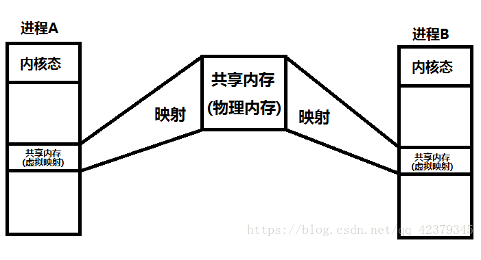
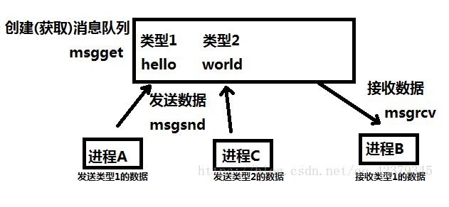
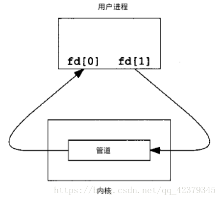
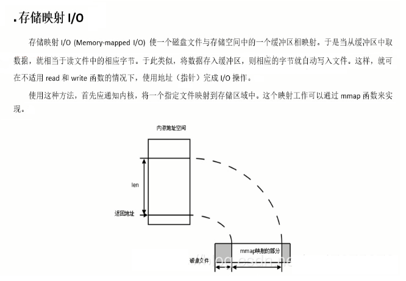

<!-- TOC -->

- [进程间的通信方式有这样几种：](#进程间的通信方式有这样几种)
    - [共享内存](#共享内存)
    - [消息队列](#消息队列)
    - [信号量](#信号量)
        - [为什么要使用信号量](#为什么要使用信号量)
        - [信号量的工作原理](#信号量的工作原理)
        - [信号号相关的两个结构体](#信号号相关的两个结构体)
    - [有名管道](#有名管道)
        - [创建命名管道](#创建命名管道)
        - [打开命名管道](#打开命名管道)
        - [阻塞问题](#阻塞问题)
        - [使用FIFO实现进程间的通信](#使用fifo实现进程间的通信)
        - [命名管道的安全问题](#命名管道的安全问题)
    - [无名管道](#无名管道)
    - [信号](#信号)
    - [文件 内存映射](#文件-内存映射)
    - [套接字 socket](#套接字-socket)
    - [进程间通信各种方式效率比较](#进程间通信各种方式效率比较)
- [线程间的通信方式有这样几种：](#线程间的通信方式有这样几种)

<!-- /TOC -->

<a id="markdown-进程间的通信方式有这样几种" name="进程间的通信方式有这样几种"></a>
## 进程间的通信方式有这样几种：

<a id="markdown-共享内存" name="共享内存"></a>
### 共享内存

共享内存是运行在同一台机器上的进程间通信最快的方式，因为数据不需要在不同的进程间复制。通常由一个进程创建一块共享内存区，其余进程对这块内存区进行读写。得到共享内存有两种方式：
- 映射/dev/mem设备
- 内存映像文件。

前一种方式不给系统带来额外的开销，但在现实中并不常用，因为它控制存取的将是实际的物理内存，在Linux系统下，这只有通过限制Linux系统存取的内存才可以做到，这当然不太实际。常用的方式是通过shmXXX函数族来实现利 用共享内存进行存储的。 



采用共享内存进行通信的一个主要好处是效率高，因为进程可以直接读写内存，而不需要任何数据的拷贝，对于像管道和消息队里等通信方式，则需要在内核和用户空间进行四次的数据拷贝，而共享内存则只拷贝两次：一次从输入文件到共享内存区，另一次从共享内存到输出文件。

使用共享内存的步骤：
1. 申请共享内存: `int shmget(key_t key, int size, int flag);`
    - key_t: 与信号量的semget函数一样，程序需要提供一个参数key（非0整数），它有效地为共享内存段命名，shmget()函数成功时返回一个与key相关的共享内存标识符（非负整数），用于后续的共享内存函数。调用失败返回-1.
    不相关的进程可以通过该函数的返回值访问同一共享内存，它代表程序可能要使用的某个资源，程序对所有共享内存的访问都是间接的，程序先通过调用shmget()函数并提供一个键，再由系统生成一个相应的共享内存标识符（shmget()函数的返回值），只有shmget()函数才直接使用信号量键，所有其他的信号量函数使用由semget函数返回的信号量标识符。
    - size以字节为单位指定需要共享的内存容量
    - flag是权限标志，它的作用与open函数的mode参数一样，如果要想在key标识的共享内存不存在时，创建它的话，可以与IPC_CREAT做或操作。共享内存的权限标志与文件的读写权限一样，举例来说，0644,它表示允许一个进程创建的共享内存被内存创建者所拥有的进程向共享内存读取和写入数据，同时其他用户创建的进程只能读取共享内存。
2. 映射: `void *shmat(int shmid, void *addr, int flag);`   -- at：attach
    - shm_id是由shmget()函数返回的共享内存标识。
    - shm_addr指定共享内存连接到当前进程中的地址位置，通常为空，表示让系统来选择共享内存的地址。
    - shm_flg是一组标志位，通常为0。
    - 调用成功时返回一个指向共享内存第一个字节的指针，如果调用失败返回-1.

3. 使用: 
4. 解除映射: `int shmdt(const void *shmaddr);` -- dt：detach
    - shmaddr是shmat()函数返回的地址指针，调用成功时返回0，失败时返回-1.
5. 销毁共享内存: `int shmctl(int shm_id, int command, struct shmid_ds *buf);`
    - shm_id是shmget()函数返回的共享内存标识符。
    - command是要采取的操作，它可以取下面的三个值 ：
        - IPC_STAT：把shmid_ds结构中的数据设置为共享内存的当前关联值，即用共享内存的当前关联值覆盖shmid_ds的值。
        - IPC_SET：如果进程有足够的权限，就把共享内存的当前关联值设置为shmid_ds结构中给出的值
        - IPC_RMID：删除共享内存段
    - buf是一个结构指针，它指向共享内存模式和访问权限的结构。
    - shmid_ds结构 至少包括以下成员：

        ```c
        struct shmid_ds
        {
            uid_t shm_perm.uid;
            uid_t shm_perm.gid;
            mode_t shm_perm.mode;
        };
        ```
6. 实例
```c
// shmdata.h
#ifndef _SHMDATA_H_HEADER
#define _SHMDATA_H_HEADER
#define TEXT_SZ 2048
struct shared_use_st
{
    int written; // 作为一个标志，非0：表示可读，0：表示可写
    char text[TEXT_SZ]; // 记录写入 和 读取 的文本
};
#endif

// shmread.c
#include <stddef.h>
#include <sys/shm.h>
#include <stdio.h>
#include <stdlib.h>
#include <unistd.h>
#include <string.h>
#include "shmdata.h"
 
int main(int argc, char **argv)
{
    void *shm = NULL;
    struct shared_use_st *shared; // 指向shm
    int shmid; // 共享内存标识符
    // 创建共享内存
    shmid = shmget((key_t)1234, sizeof(struct shared_use_st), 0666|IPC_CREAT);
    if (shmid == -1) {
        fprintf(stderr, "shmat failed\n");
        exit(EXIT_FAILURE);
    }
 
    // 将共享内存连接到当前进程的地址空间
    shm = shmat(shmid, 0, 0);
    if (shm == (void *)-1) {
        fprintf(stderr, "shmat failed\n");
        exit(EXIT_FAILURE);
    }
 
    printf("\nMemory attached at %X\n", (int)shm);
 
    // 设置共享内存
    shared = (struct shared_use_st*)shm; // 注意：shm有点类似通过 malloc() 获取到的内存，所以这里需要做个 类型强制转换
    shared->written = 0;
    // 读取共享内存中的数据
    while (1) {
        // 没有进程向内存写数据，有数据可读取
        if (shared->written == 1) {
            printf("You wrote: %s", shared->text);
            sleep(1);
            // 读取完数据，设置written使共享内存段可写
            shared->written = 0;
            // 输入了 end，退出循环（程序）
            if (strncmp(shared->text, "end", 3) == 0) {
                break;
            }
        }
        // 有其他进程在写数据，不能读取数据
        else {
            sleep(1);
        }
    }
 
    // 把共享内存从当前进程中分离
    if (shmdt(shm) == -1) {
        fprintf(stderr, "shmdt failed\n");
        exit(EXIT_FAILURE);
    }
 
    // 删除共享内存
    if (shmctl(shmid, IPC_RMID, 0) == -1) {
        fprintf(stderr, "shmctl(IPC_RMID) failed\n");
        exit(EXIT_FAILURE);
    }
    exit(EXIT_SUCCESS);
}

// shmwrite.c
#include <unistd.h>
#include <stdlib.h>
#include <stdio.h>
#include <string.h>
#include <sys/shm.h>
#include "shmdata.h"
 
int main(int argc, char **argv) {
    void *shm = NULL;
    struct shared_use_st *shared = NULL;
    char buffer[BUFSIZ + 1]; // 用于保存输入的文本
    int shmid;
 
    // 创建共享内存
    shmid = shmget((key_t)1234, sizeof(struct shared_use_st), 0666|IPC_CREAT);
    if (shmid == -1) {
        fprintf(stderr, "shmget failed\n");
        exit(EXIT_FAILURE);
    }
 
    // 将共享内存连接到当前的进程地址空间
    shm = shmat(shmid, (void *)0, 0);
    if (shm == (void *)-1) {
        fprintf(stderr, "shmat failed\n");
        exit(EXIT_FAILURE);
    }
    printf("Memory attched at %X\n", (int)shm);
 
    // 设置共享内存
    shared = (struct shared_use_st *)shm;
    // 向共享内存中写数据
    while (1) {
        // 数据还没有被读取，则等待数据被读取，不能向共享内存中写入文本
        while (shared->written == 1) {
            sleep(1);
            printf("Waiting...\n");
        } 
        // 向共享内存中写入数据
        printf("Enter some text: ");
        fgets(buffer, BUFSIZ, stdin);
        strncpy(shared->text, buffer, TEXT_SZ);
        // 写完数据，设置written使共享内存段可读
        shared->written = 1; 
        // 输入了end，退出循环（程序）
        if (strncmp(buffer, "end", 3) == 0) {
            break;
        }
    }
 
    // 把共享内存从当前进程中分离
    if (shmdt(shm) == -1) {
        fprintf(stderr, "shmdt failed\n");
        exit(EXIT_FAILURE);
    }
    sleep(2);
    exit(EXIT_SUCCESS);
}
```
<a id="markdown-消息队列" name="消息队列"></a>
### 消息队列

消息队列(Message Queue)，就是一个消息的链表，是一系列保存在内核中消息的列表。用户进程可以向消息队列添加消息，也可以向消息队列读取消息。

消息队列与管道通信相比，其优势是对每个消息指定特定的消息类型，接收的时候不需要按照队列次序，而是可以根据自定义条件接收特定类型的消息。

特点：

    - 生命周期随内核，消息队列会一直存在，需要我们显示的调用接口删除或使用命令删除
    - 消息队列可以双向通信
    - 克服了管道只能承载无格式字节流的缺点



`int msgget(key_t key, int msgflag);` 创建和访问一个消息队列 

- key：某个消息队列的名字，用ftok()产生 
- msgflag：有两个选项IPC_CREAT和IPC_EXCL，单独使用IPC_CREAT，如果消息队列不存在则创建之，如果存在则打开返回；单独使用IPC_EXCL是没有意义的；两个同时使用，如果消息队列不存在则创建之，如果存在则出错返回。 
- 返回值：成功返回一个非负整数，即消息队列的标识码，失败返回-1

`key_t ftok(const char *pathname, int proj_id);` 某个消息队列的名字
- fname就时你指定的文件名(该文件必须是存在而且可以访问的)
- id是子序号，虽然为int，但是只有8个比特被使用(0-255)。
- 当成功执行的时候，一个key_t值将会被返回，否则 -1 被返回。

`int msgctl(int msqid, int cmd, struct msqid_ds *buf);` 消息队列的控制函数 
- msqid：由msgget函数返回的消息队列标识码 
- cmd：有三个可选的值，在此我们使用IPC_RMID
    - IPC_STAT 把msqid_ds结构中的数据设置为消息队列的当前关联值
    - IPC_SET 在进程有足够权限的前提下，把消息队列的当前关联值设置为msqid_ds数据结构中给出的值
    - IPC_RMID 删除消息队列
- 成功返回0，失败返回-1

`int msgsnd(int msqid, const void *msgp, size_t msgsz, int msgflg);` 把一条消息添加到消息队列中 

- msgid：由msgget函数返回的消息队列标识码 
- msgp：指针指向准备发送的消息 
- msgze：msgp指向的消息的长度（不包括消息类型的long int长整型） 
- msgflg：默认为0 
- 返回值：成功返回0，失败返回-1
消息结构一方面必须小于系统规定的上限，另一方面必须以一个long int长整型开始，接受者以此来确定消息的类型
```c
struct msgbuf {
     long mtye;
     char mtext[1];
};
```

`ssize_t msgrcv(int msqid, void *msgp, size_t msgsz, long msgtyp, int msgflg); ` 是从一个消息队列接受消息
- msgid：由msgget函数返回的消息队列标识码 
- msgp：指针指向准备发送的消息 
- msgze：msgp指向的消息的长度（不包括消息类型的long int长整型） 
- msgflg：默认为0 
- 返回值：成功返回0，失败返回-1
消息结构一方面必须小于系统规定的上限，另一方面必须以一个long int长整型开始，接受者以此来确定消息的类型

此外，我们还需要学习两个重要的命令, 前面我们说过，消息队列需要手动删除IPC资源 
- ipcs:显示IPC资源 
- ipcrm:手动删除IPC资源

```c
// msg_send.c
#include <stdio.h>
#include <sys/types.h>
#include <sys/ipc.h>
#include <sys/msg.h>
#include <string.h>
#include <stdlib.h>
#include <unistd.h>
#include <signal.h>
 
#define MSGKEY 1234
 
struct msgbuf {
	long mtype;     /* message type, must be > 0 */
	char mtext[100];  /* message data */
};
 
int main() {
	int msgid;
	int ret;
	struct msgbuf mbuf;
	pid_t pid;
 
	msgid = msgget(MSGKEY, IPC_CREAT | IPC_EXCL);	//创建消息队列
	if (-1 == msgid) {
		perror("msgget");
		exit(1);
	}
	pid = fork();
	if (-1 == pid) {
		perror("fork");
		exit(1);
	} else if (0 == pid) {		//子进程发送数据	
		while (1) {
			memset(mbuf.mtext, 0, sizeof(mbuf.mtext));
			scanf("%s", mbuf.mtext);
			mbuf.mtype = 1;
 
			ret = msgsnd(msgid, &mbuf, sizeof(mbuf.mtext), 0);
			if (-1 == ret) {
				perror("msgsnd");
				exit(1);
			}
			if (!strcmp(mbuf.mtext, "bye")) {
				mbuf.mtype = 2;
				msgsnd(msgid, &mbuf, sizeof(mbuf.mtext), 0);
				break;
			}
		}
	} else { //父进程接收数据
		while (1) {
			memset(mbuf.mtext, 0, sizeof(mbuf.mtext)); 
			ret = msgrcv(msgid, &mbuf, sizeof(mbuf.mtext), 2,0);
			if (-1 == ret) {
				perror("msgrcv");
				exit(1);
			} 
			if (!strcmp(mbuf.mtext, "bye")) {
				kill(pid, 2);
				break;
			}
			printf("\t%s\n", mbuf.mtext);
		}
	}
	sleep(1);
	msgctl(msgid, IPC_RMID, NULL);//销毁消息队列
	return 0;
}

// msg_write.c
#include <stdio.h>
#include <sys/types.h>
#include <sys/ipc.h>
#include <sys/msg.h>
#include <string.h>
#include <stdlib.h>
#include <unistd.h>
#include <signal.h>
 
#define MSGKEY 1234
 
struct msgbuf {
	long mtype;     /* message type, must be > 0 */
	char mtext[100];  /* message data */
};

int main() {
	int msgid;
	int ret;
	struct msgbuf mbuf;
	pid_t pid;
 
	msgid = msgget(MSGKEY, 0);	//打开消息队列
	if (-1 == msgid) {
		perror("msgget");
		exit(1);
	}
 
	pid = fork();
	if (-1 == pid) {
		perror("fork");
		exit(1);
	}
	else if (0 == pid) {  //子进程发送数据
		while (1) {
			memset(mbuf.mtext, 0, sizeof(mbuf.mtext));
			scanf("%s", mbuf.mtext);
			mbuf.mtype = 2;
			ret = msgsnd(msgid, &mbuf, sizeof(mbuf.mtext), 0);
			if (-1 == ret) {
				perror("msgsnd");
				exit(1);
			}
 
			if (!strcmp(mbuf.mtext, "bye")) {
				mbuf.mtype = 1;
				msgsnd(msgid, &mbuf, sizeof(mbuf.mtext), 0); 
				break;
			}
		}
	}
	else { //父进程接收数据
		while (1) {
			memset(mbuf.mtext, 0, sizeof(mbuf.mtext));
			ret = msgrcv(msgid, &mbuf, sizeof(mbuf.mtext), 1,0);
			if (-1 == ret) {
				perror("msgrcv");
				exit(1);
			} 
			if (!strcmp(mbuf.mtext, "bye")) {
				kill(pid, 2);
				break;
			}
			printf("\t%s\n", mbuf.mtext);
		}
	}
	return 0;
}
```
<a id="markdown-信号量" name="信号量"></a>
### 信号量
<a id="markdown-为什么要使用信号量" name="为什么要使用信号量"></a>
#### 为什么要使用信号量
为了防止出现因多个程序同时访问一个共享资源而引发的一系列问题，我们需要一种方法，它可以通过生成并使用令牌来授权，在任一时刻只能有一个执行线程访问 代码的临界区域。临界区域是指执行数据更新的代码需要独占式地执行。而信号量就可以提供这样的一种访问机制，让一个临界区同一时间只有一个线程在访问它， 也就是说信号量是用来调协进程对共享资源的访问的。其中共享内存的使用就要用到信号量。
<a id="markdown-信号量的工作原理" name="信号量的工作原理"></a>
#### 信号量的工作原理
由于信号量只能进行两种操作等待和发送信号，即P(sv)和V(sv),他们的行为是这样的：
- P(sv)：如果sv的值大于零，就给它减1；如果它的值为零，就挂起该进程的执行
- V(sv)：如果有其他进程因等待sv而被挂起，就让它恢复运行，如果没有进程因等待sv而挂起，就给它加1.
 
举个例子，就是 两个进程共享信号量sv，一旦其中一个进程执行了P(sv)操作，它将得到信号量，并可以进入临界区，使sv减1。而第二个进程将被阻止进入临界区，因为 当它试图执行P(sv)时，sv为0，它会被挂起以等待第一个进程离开临界区域并执行V(sv)释放信号量，这时第二个进程就可以恢复执行。
<a id="markdown-信号号相关的两个结构体" name="信号号相关的两个结构体"></a>
#### 信号号相关的两个结构体

```c
// 内核为每个信号量集合设置了一个semid_ds结构
struct semid_ds {
    struct ipc_permsem_perm ;
    structsem* sem_base ; //信号数组指针
    ushort sem_nsem ; //此集中信号个数
    time_t sem_otime ; //最后一次semop时间
    time_t sem_ctime ; //最后一次创建时间
};

// 每个信号量由一个无名结构表示，它至少包含下列成员： （这个是什么意思？？）
struct {
    ushort_t semval ; //信号量的值
    short sempid ; //最后一个调用semop的进程ID
    ushort semncnt ; //等待该信号量值大于当前值的进程数（一有进程释放资源 就被唤醒）
    ushort semzcnt ; //等待该信号量值等于0的进程数
};
```
`int semget (key_t key, int nsem, int oflag);` 创建一个信号量集或访问一个已存在的信号量集。
- nsem指定集合中的信号量数。（若用于访问一个已存在的集合，那就可以把该参数指定为0）
- oflag可以是SEM_R(read)和SEM_A(alter)常值的组合。（打开时用到），也可以是IPC_CREAT或IPC_EXCL ;
- 返回值是一个称为信号量标识符的整数，semop和semctl函数将使用它。

`int semop (int semid, struct sembuf * opsptr, size_t nops);` 打开一个信号量集后，对其中一个或多个信号量的操作就使用semop(op--operate)函数来执行。

- opsptr是一个指针，它指向一个信号量操作数组，信号量操作由sembuf结构表示：
```c
struct sembuf {
    short sem_num; // 除非使用一组信号量，否则它为0
    short sem_op; // 信号量在一次操作中需要改变的数据，通常是两个数，
    // 一个是-1，即P（等待）操作，一个是+1，即V（发送信号）操作
    short sem_flg; // 通常为SEM_UNDO,使操作系统跟踪信号，并在进程没有释放该信号量而终止时，
    // 操作系统释放信号量
};
```
- nops规定opsptr数组中元素个数。
- sem_op值：
 1. 若sem_op为正，这对应于进程释放占用的资源数。sem_op值加到信号量的值上。（V操作）
 2. 若sem_op为负,这表示要获取该信号量控制的资源数。信号量值减去sem_op的绝对值。（P操作）
 3. 若sem_op为0,这表示调用进程希望等待到该信号量值变成0
- 如果信号量值小于sem_op的绝对值（资源不能满足要求），则：
 1. 若指定了IPC_NOWAIT，则semop()出错返回EAGAIN。
 2. 若未指定IPC_NOWAIT，则信号量的semncnt值加1（因为调用进程将进 入休眠状态），然后调用进程被挂起直至
    1. 此信号量变成大于或等于sem_op的绝对值
    2. 从系统中删除了此信号量，返回EIDRM
    3. 进程捕捉到一个信 号，并从信号处理程序返回，返回EINTR。（与消息队列的阻塞处理方式 很相似）

`int semctl (int semid, int semnum, int cmd, /*可选参数*/) ;` 对一个信号量执行各种控制操作。

- 第四个参数是可选的，取决于第三个参数cmd。
- semnum指定信号集中的哪个信号（操作对象）
- cmd指定以下10种命令中的一种,在semid指定的信号量集合上执行此命令。
    - IPC_STAT  读取一个信号量集的数据结构semid_ds，并将其存储在semun中的buf参数中。
    - IPC_SET   设置信号量集的数据结构semid_ds中的元素ipc_perm，其值取自semun中的buf参数。
    - IPC_RMID  将信号量集从内存中删除。
    - GETALL    用于读取信号量集中的所有信号量的值。
    - GETNCNT   返回正在等待资源的进程数目。
    - GETPID    返回最后一个执行semop操作的进程的PID。
    - GETVAL    返回信号量集中的一个单个的信号量的值。
    - GETZCNT   返回这在等待完全空闲的资源的进程数目。
    - SETALL    设置信号量集中的所有的信号量的值。
    - SETVAL    设置信号量集中的一个单独的信号量的值。

```c
// sem1.c
#include <stdio.h>
#include <stdlib.h>
#include <unistd.h>
#include <sys/ipc.h>
#include <sys/shm.h>
#include <sys/types.h>
#include <sys/sem.h>
 
#define SHMKEY 1234
#define SHMSIZE 4096
#define SEMKEY 1234
 
union semun {
	int val;    /* Value for SETVAL */
	struct semid_ds *buf;    /* Buffer for IPC_STAT, IPC_SET */
	unsigned short  *array;  /* Array for GETALL, SETALL */
	struct seminfo  *__buf;  /* Buffer for IPC_INFO(Linux specific) */
};

void sem_p(int semid) {
	int ret;
	struct sembuf sbuf;
	sbuf.sem_num = 0;//第一个
	sbuf.sem_op = -1;//P操作
	sbuf.sem_flg = SEM_UNDO;//SEM_UNDO进程异常自动UNDO
	ret = semop(semid, &sbuf, 1);
	if (ret == -1) {
		perror("semop");
		return;
	}
}
void sem_v(int semid)
{
	int ret;
	struct sembuf sbuf;
	sbuf.sem_num = 0;//第一个
	sbuf.sem_op = 1;//V操作
	sbuf.sem_flg = SEM_UNDO;//SEM_UNDO进程异常自动UNDO 
	ret = semop(semid, &sbuf, 1);
	if (ret == -1) {
		perror("semop");
		return;
	}
}
 
int main() {
	int shmid;
	void *shmaddr;
	int count = 0;
	int semid;
	union semun unsem; 
	semid = semget(SEMKEY, 1, IPC_CREAT | IPC_EXCL);	//创建信号量
	if (-1 == semid) {
		perror("semget");
		exit(1);
	} 
	unsem.val = 1;//初始化成二值信号量
	semctl(semid, 0, SETVAL, unsem);//初始化信号量 
	shmid = shmget(SHMKEY, SHMSIZE, IPC_CREAT | IPC_EXCL);//创建共享内存
	if (-1 == shmid) {
		perror("shmget");
		exit(1);
	}
	shmaddr = shmat(shmid, NULL, 0);//映射到虚拟地址空间
	if (NULL == shmaddr) {
		perror("shmat");
		exit(1);
	} 
	*(int *)shmaddr = count;//把数据写到内存
	while(1) {
		sem_p(semid);//P操作
		count = *(int *)shmaddr;//从内存读数据
		usleep(100000);
		if (count > 100) {
			break;
		}
		printf("A:%d\n", count);
		count++;
		*(int *)shmaddr = count;//数据写回内存
		//usleep(100000);
		sem_v(semid);//V操作
	}
	shmdt(shmaddr);		//解除映射
	sleep(1);
	shmctl(shmid, IPC_RMID, NULL);//销毁映射
	semctl(semid, 0, IPC_RMID);//销毁信号量
	return 0;
}

// sem2.c
#include <stdio.h>
#include <stdlib.h>
#include <unistd.h>
#include <sys/ipc.h>
#include <sys/shm.h>
#include <sys/types.h>
#include <sys/sem.h>

#define SHMKEY 1234
#define SHMSIZE 4096
#define SEMKEY 1234
 
union semun {
	int val;    /* Value for SETVAL */
	struct semid_ds *buf;    /* Buffer for IPC_STAT, IPC_SET */
	unsigned short  *array;  /* Array for GETALL, SETALL */
	struct seminfo  *__buf;  /* Buffer for IPC_INFO(Linux specific) */
};
 
void sem_p(int semid) {
	int ret;
	struct sembuf sbuf;
 
	sbuf.sem_num = 0;//第一个
	sbuf.sem_op = -1;//P操作
	sbuf.sem_flg = SEM_UNDO;//SEM_UNDO进程异常自动UNDO
 
	ret = semop(semid, &sbuf, 1);
	if (ret == -1) {
		perror("semop_p");
		return;
	}
}
void sem_v(int semid) {
	int ret;
	struct sembuf sbuf;
 
	sbuf.sem_num = 0;//第一个
	sbuf.sem_op = 1;//V操作
	sbuf.sem_flg = SEM_UNDO;//SEM_UNDO进程异常自动UNDO
 
	ret = semop(semid, &sbuf, 1);
	if (ret == -1) {
		perror("semop_v");
		return;
	}
}
 
int main() {
	int shmid;
	void *shmaddr;
	int count = 0;
	int semid;
	union semun unsem;
 
	semid = semget(SEMKEY, 1, 0);	//获取信号量
	if (-1 == semid) {
		perror("semget");
		exit(1);
	}
 
	//unsem.val = 1;
	//semctl(semid, 0, SETVAL, unsem);//初始化信号量
 
	shmid = shmget(SHMKEY, SHMSIZE, 0);//获取共享内存
	if (-1 == shmid) {
		perror("shmget");
		exit(1);
	}
 
	shmaddr = shmat(shmid, NULL, 0);//映射到虚拟地址空间
	if (NULL == shmaddr) {
		perror("shmat");
		exit(1);
	}
 
	while(1) {
		sem_p(semid);//P操作
		count = *(int *)shmaddr;//从内存读数据
		usleep(100000); 
		if (count > 100) {
			break;
		}
		printf("B:%d\n", count);
		count++; 
		*(int *)shmaddr = count;//数据写回内存 
		//usleep(100000); 
		sem_v(semid);//V操作
	} 
	shmdt(shmaddr);		//解除映射
	return 0;
}
```
<a id="markdown-有名管道" name="有名管道"></a>
### 有名管道

命名管道也被称为FIFO文件，是一种特殊的文件。由于linux所有的事物都可以被视为文件，所以对命名管道的使用也就变得与文件操作非常统一。

<a id="markdown-创建命名管道" name="创建命名管道"></a>
#### 创建命名管道
`int mkfifo(const char *filename, mode_t mode);` 创建命名管道
`int mknod(const char *filename, mode_t mode | S_IFIFO, (dev_t)0);` 创建命名管道

- filname是指文件名
- 而mode是指定文件的读写权限。mknod是比较老的函数，而使用mkfifo函数更加简单和规范，所以建议用mkfifo。

<a id="markdown-打开命名管道" name="打开命名管道"></a>
#### 打开命名管道
```
open(const char *path, O_RDONLY); // 1
open(const char *path, O_RDONLY | O_NONBLOCK); // 2
open(const char *path, O_WRONLY); // 3
open(const char *path, O_WRONLY | O_NONBLOCK); // 4
```

和打开其他文件一样，可以用open来打开。通常有四种方法：

有两点要注意:
1. 就是程序不能以O_RDWR(读写)模式打开FIFO文件进行读写操作，而其行为也未明确定义，因为如一个管道以读/写方式打开，进程就会读回自己的输出，同时我们通常使用FIFO只是为了单向的数据传递。

2. 就是传递给open调用的是FIFO的路径名，而不是正常的文件。（如：const char *fifo_name = "/tmp/my_fifo"; ）

3. 第二个参数中的选项O_NONBLOCK，选项O_NONBLOCK表示非阻塞，加上这个选项后，表示open调用是非阻塞的，如果没有这个选项，则表示open调用是阻塞的。

<a id="markdown-阻塞问题" name="阻塞问题"></a>
#### 阻塞问题
- 对于以只读方式（O_RDONLY）打开的FIFO文件，如果open调用是阻塞的（即第二个参数为O_RDONLY），除非有一个进程以写方式打开同一个FIFO，否则它不会返回；如果open调用是非阻塞的的（即第二个参数为O_RDONLY | O_NONBLOCK），则即使没有其他进程以写方式打开同一个FIFO文件，open调用将成功并立即返回。
- 对于以只写方式（O_WRONLY）打开的FIFO文件，如果open调用是阻塞的（即第二个参数为O_WRONLY），open调用将被阻塞，直到有一个进程以只读方式打开同一个FIFO文件为止；如果open调用是非阻塞的（即第二个参数为O_WRONLY | O_NONBLOCK），open总会立即返回，但如果没有其他进程以只读方式打开同一个FIFO文件，open调用将返回-1，并且FIFO也不会被打开。

<a id="markdown-使用fifo实现进程间的通信" name="使用fifo实现进程间的通信"></a>
#### 使用FIFO实现进程间的通信
管道的写入端从一个文件读出数据，然后写入写管道。管道的读取端从管道读出后写到文件中。

<a id="markdown-命名管道的安全问题" name="命名管道的安全问题"></a>
#### 命名管道的安全问题

有一种情况是：一个FIFO文件，有多个进程同时向同一个FIFO文件写数据，而只有一个读FIFO进程在同一个FIFO文件中读取数据时，会发生数据块的相互交错。不同进程向一个FIFO读进程发送数据是很普通的情况。这个问题的解决方法，就是让写操作的原子化。系统规定：在一个以O_WRONLY（即阻塞方式）打开的FIFO中， 如果写入的数据长度小于等待PIPE_BUF，那么或者写入全部字节，或者一个字节都不写入。如果所有的写请求都是发往一个阻塞的FIFO的，并且每个写记请求的数据长度小于等于PIPE_BUF字节，系统就可以确保数据决不会交错在一起。

```c
// fifo_read.c
#include<stdio.h>
#include <stdlib.h>
#include <string.h>
#include <unistd.h>
#include <sys/types.h>
#include <sys/stat.h>
#include <fcntl.h>
 
int main() {
	char buf[32] = {0};
	int fd;
	int ret;
	fd = mkfifo("fifo.tmp", S_IRWXU);//创建有名管道
	if (-1 == fd) {
		perror("mkfifo");
		exit(1);
	}
	fd = open("fifo.tmp", O_RDONLY);//只读方式打开文件fifo.tmp
	if (-1 == fd) {
		perror("open");
		exit(1);
	}
 
	while(1) {
		ret = read(fd, buf, sizeof(buf));//从文件中读取数据
		if (-1 == ret) {
			perror("read");
			exit(1);
		}
        // 读取到bye结束循环
		if (!strcmp(buf, "bye")) {
			break;
		}		
		printf("read:%s\n", buf);
		memset(buf, 0, sizeof(buf));
	}
	close(fd);
	unlink("fifo.tmp");//在管道使用结束后删除文件fifo.tmp
	return 0;
}

// fifo_write.c
#include <stdio.h>
#include <stdlib.h>
#include <string.h>
#include <unistd.h>
#include <sys/types.h>
#include <sys/stat.h>
#include <fcntl.h>
 
int main() {
	int fd;
	int ret;
	char buf[32] = {0};
	fd = open("fifo.tmp", O_WRONLY);//以只写方式打开文件fifo.tmp
	while (1) {
		scanf("%s", buf);
		ret = write(fd, buf, strlen(buf));//写入数据到文件
		if (-1 == ret) {
			perror("write");
			exit(1);
		}
        // 输入bye结束写入
		if (!strcmp(buf, "bye")) {
			break;
		}
		memset(buf, 0, sizeof(buf));
	}
	close(fd);
	return 0;
}
```
<a id="markdown-无名管道" name="无名管道"></a>
### 无名管道

无名管道是半双工的，就是对于一个管道来讲，只能读，或者写。
无名管道只能在相关的，有共同祖先的进程间使用（即一般用户父子进程）。
一个fork或者execve调用创建的子进程继承了父进程的文件描述符。

`int pipe(int filedes[2]);` 打开和关闭管道
在你从一个管道中读出或者写入数据，这个管道必须存在。
如果成功建立了管道，则会打开两个文件描述符，并把他们的值保存在一个整数数组中。
- fd[0] 第一个文件描述符用于读取数据, 一端只负责读数据
- fd[1] 第二个文件描述符用于写入数据。一端只负责写数据
- 如果出错返回-1，同时设置errno

`close()` 关闭一个文件描述符用close()函数



```c
#include <stdio.h>
#include <stdlib.h>
#include <string.h>
#include <unistd.h>
#include <sys/types.h>
#include <sys/wait.h>

// 读管道
void ReadPipe(int fd)
{
	int ret;
	char buf[32] = {0};
	
	while(1) {
		ret = read(fd, buf, sizeof(buf));
		if (-1 == ret)
		{
			perror("read");
			exit(1);
		}
		if (!strcmp(buf, "bye"))
		{
			break;
		}
		printf("read from pipe: %s\n", buf);
		memset(buf, 0, sizeof(buf));
	}
	close(fd);
}

//写管道
void WritePipe(int fd) {
	int ret;
	char buf[32] = {0};
	while (1) {
		scanf("%s", buf);
		ret = write(fd, buf, strlen(buf));
		if (-1 == ret) {
			perror("write");
			exit(1);
		}
		if (!strcmp(buf, "bye")) {
			break;
		}
		memset(buf, 0, sizeof(buf));
	}
	close(fd);
}
 
int main() {
	int fd[2];
	int ret;
	pid_t pid;
	ret = pipe(fd);	//创建管道
	if (-1 == ret) {
		perror("pipe");
		exit(1);
	} 
	pid = fork();  //创建进程
	if (-1 == pid) {
		perror("fork");
		exit(1);
	}
	else if (0 == pid) {
		close(fd[1]);		//关闭写端口
		ReadPipe(fd[0]);	//fd[0]读数据
	}
	else {
		close(fd[0]);		//关闭读端口
		WritePipe(fd[1]);	//fd[1]写数据
		int status;
		wait(&status);
	}
	return 0;
}
```
<a id="markdown-信号" name="信号"></a>
### 信号
信号(signal)机制是Unix系统中最为古老的进程间通信机制，很多条件可以产生一个信号：

1. 当用户按某些按键时，产生信号。
2. 硬件异常产生信号：除数为0、无效的存储访问等等。这些情况通常由硬件检测到，将其通知内核，然后内核产生适当的信号通知进程，例如，内核对正访问一个无效存储区的进程产生一个SIGSEGV信号 。
3. 进程用kill函数将信号发送给另一个进程。
4. 用户可用kill命令将信号发送给其他进程。

当某信号出现时，将按照下列三种方式中的一种进行处理：
1. 忽略此信号，大多数信号都按照这种方式进行处理，但有两种信号决不能被忽略,它们是： SIGKILL\SIGSTOP。 这是因为这两种信号向超级用户提供了一种终止或停止进程的方法。
2. 执行系统默认动作，对大多数信号的系统默认动作是终止该进程。
3. 执行用户希望的动作，通知内核在某种信号发生时，调用一个用户函数。在用户函数中，执行用户希望的处理。

在终端中输入 kill -l 可以查看到系统设定的信号的宏定义。
发送信号的函数有
- `kill(向任意进程发送信号)`
- `raise(只能向当前进程发送信号)`
- `abort(发送SIGABRT信号，可以让进程异常终止)`
- `alarm(发送SIGALRM闹钟信号)`

```c
// 实例：实现0-59的计时，计时到60时变为0.
// 使用alarm函数可以设置一个时间值(闹钟时间)，当所设置的时间到了时，产生SIGALRM信号。然后使用signal函数捕捉SIGALRM信号，并且自定义信号处理方式。

#include<stdio.h>
#include <unistd.h>
#include <signal.h>
#include <stdlib.h>
int t;

void print() {
	system("clear"); // 清屏
	alarm(1);        // 1秒后给当前进程发送一个SIGALRM信号，一直在执行
	printf("%d\n", (t++)%60);
}
 
int main() {
	system("clear");// 清屏
	alarm(1);       // 1秒后给当前进程发送一个SIGALRM信号，只执行一次
	signal(SIGALRM, print);
	while (1);      // 必须有，不然进程就直接结束了
	return 0;
}
```
<a id="markdown-文件-内存映射" name="文件-内存映射"></a>
### 文件 内存映射
内存映射文件，是由一个文件到一块内存的映射。内存映射文件与虚拟内存有些类似，通过内存映射文件可以保留一个地址的区域，

同时将物理存储器提交给此区域，内存文件映射的物理存储器来自一个已经存在于磁盘上的文件，而且在对该文件进行操作之前必须首先对文件进行映射。使用内存映射文件处理存储于磁盘上的文件时，将不必再对文件执行I/O操作。每一个使用该机制的进程通过把同一个共享的文件映射到自己的进程地址空间来实现多个进程间的通信（这里类似于共享内存，只要有一个进程对这块映射文件的内存进行操作，其他进程也能够马上看到）。

使用内存映射文件不仅可以实现多个进程间的通信，还可以用于处理大文件提高效率。因为我们普通的做法是把磁盘上的文件先拷贝到内核空间的一个缓冲区再拷贝到用户空间（内存），用户修改后再将这些数据拷贝到缓冲区再拷贝到磁盘文件，一共四次拷贝。如果文件数据量很大，拷贝的开销是非常大的。那么问题来了，系统在在进行内存映射文件就不需要数据拷贝？mmap()确实没有进行数据拷贝，真正的拷贝是在在缺页中断处理时进行的，由于mmap()将文件直接映射到用户空间，所以中断处理函数根据这个映射关系，直接将文件从硬盘拷贝到用户空间，所以只进行一次数据拷贝。效率高于read/write。



`void *mmap(void *addr, size_t length, int prot, int flags, int fd, off_t offset);` 
- addr 指定映射区的首地址，通常是NULL，表示让系统自动分配
- length 共享内存映射区的大小
- prot 共享内存映射区的读写属性
    1. PROT_EXEC 表示映射的这一段可执行，例如映射共享库 
    2. PROT_READ 表示映射的这一段可读 
    3. PROT_WRITE 表示映射的这一段可写 
    4. PROT_NONE 表示映射的这一段不可访问 
- flags 标注共享内存的共享属性
    1. MAP_SHARED： 共享的形式，对内存块所做的修改将保存到文件中，多个进程对同一个文件的映射是共享的，一个进程对映射的内存做了修改，另一个进程也会看到这种变化。
    2. MAP_PRIVATE： 私有的，对内存块的修改只在局部范围内有效，多个进程对同一个文件的映射不是共享的，一个进程对映射的内存做了修改，另一个进程并不会看到这种变化，也不会真的写到文件中去。
    3. MAP_FIXED： 使用指定的映射起始地址
    4. MAP_ANONYMOUS/MAP_ANON： 匿名映射，即不和任何文件关联，同时将 fd 设置为 -1。通常需要进程间有一定关系才能使用这种映射方式
- fd 用于创建共享内存映射区的那个文件的文件描述符
- offset 默认0，表示映射文件全部，偏移位置，必须4k的整数倍
- 返回 成功是首地址，失败 MAP_FAILED (void*(-1)), errno

`int munmap(void *addr, size_t length);` 释放映射区
- addr 指定映射区的首地址
- length 共享内存映射区的大小

实例

- 无血缘关系进程通信
```c
// write.c
#include <stdio.h>
#include <stdlib.h>
#include <string.h>
#include <errno.h>
#include <fcntl.h>
#include <unistd.h>
#include <sys/mman.h>
 
typedef struct _data {
    int a;
    char b[64];
} Data;
 
 
int main() {
    Data *addr;
    Data data = { 10, "Hello World\n" };
    int fd;
 
    fd = open("mmap_temp_file", O_RDWR|O_CREAT|O_TRUNC, 0644);
    if (fd == -1) {
        perror("open failed\n");
        exit(EXIT_FAILURE);
    }
    ftruncate(fd, sizeof(data));
 
    // 使用fd创建内存映射区
    addr = (Data *)mmap(NULL, sizeof(data), PROT_READ|PROT_WRITE, MAP_SHARED, fd, 0);
    if (addr == MAP_FAILED) {
        perror("mmap failed!\n");
        exit(EXIT_FAILURE);
    }
    close(fd); // 映射完后文件就可以关闭了
 
    memcpy(addr, &data, sizeof(data)); // 往映射区写数据
    munmap(addr, sizeof(data)); // 释放映射区
    return 0;
}

// read.c
#include <stdio.h>
#include <stdlib.h>
#include <string.h>
#include <errno.h>
#include <fcntl.h>
#include <unistd.h>
#include <sys/mman.h>
 
typedef struct _data {
    int a;
    char b[64];
} Data;
 
 
int main() {
    Data *addr;
    int fd;
 
    fd = open("mmap_temp_file", O_RDONLY);
    if (fd == -1) {
        perror("open failed\n");
        exit(EXIT_FAILURE);
    }
 
    // 使用fd创建内存映射区
    addr = (Data *)mmap(NULL, sizeof(Data), PROT_READ, MAP_SHARED, fd, 0);
    if (addr == MAP_FAILED) {
        perror("mmap failed!\n");
        exit(EXIT_FAILURE);
    }
    close(fd); // 映射完后文件就可以关闭了
 
    printf("read form mmap: a = %d, b = %s\n", addr->a, addr->b); // 往映射区写数据
    munmap(addr, sizeof(Data)); // 释放映射区
    return 0;
}
```
- 血缘关系进程通信

存在血缘关系的话，可以使用 匿名 的方式创建映射区，这样就不需要那个临时文件了。
```c
#include <stdio.h>
#include <stdlib.h>
#include <string.h>
#include <errno.h>
#include <fcntl.h>
#include <unistd.h>
#include <sys/mman.h>
 
int m_var = 100;
 
int main() {
    int *addr;
    pid_t child_pid;
 
    // 以匿名的方式创建内存映射区,适用于存在血缘关系的进程间
    addr = (int *)mmap(NULL, sizeof(int), PROT_READ|PROT_WRITE, MAP_SHARED|MAP_ANON, -1, 0);
    if (addr == MAP_FAILED) {
        perror("mmap failed!\n");
        exit(EXIT_FAILURE);
    }
 
    child_pid = fork(); // 创建子进程
    if (child_pid == 0) {
        *addr = 666; // 往内存映射区写数据
        m_var = 200;
        printf("child process: *addr = %d, m_var = %d\n", *addr, m_var);
    } else {
        sleep(1);
        printf("parent process: *addr = %d, m_var = %d\n", *addr, m_var); // 读内存映射区的数据
        wait(NULL);
 
        int ret = munmap(addr, sizeof(int)); // 释放内存映射区
        if (ret == -1) {
            perror("munmap failed\n");
            exit(EXIT_FAILURE);
        }
    }
    return 0;
}
```

共享内存和内存映射文件的区别：

- 内存映射文件是利用虚拟内存把文件映射到进程的地址空间中去，在此之后进程操作文件，就像操作进程空间里的地址一样了，比如使用c语言的memcpy等内存操作的函数。这种方法能够很好的应用在需要频繁处理一个文件或者是一个大文件的场合，这种方式处理IO效率比普通IO效率要高
- 共享内存是内存映射文件的一种特殊情况，内存映射的是一块内存，而非磁盘上的文件。共享内存的主语是进程（Process），操作系统默认会给每一个进程分配一个内存空间，每一个进程只允许访问操作系统分配给它的哪一段内存，而不能访问其他进程的。而有时候需要在不同进程之间访问同一段内存，怎么办呢？操作系统给出了 创建访问共享内存的API，需要共享内存的进程可以通过这一组定义好的API来访问多个进程之间共有的内存，各个进程访问这一段内存就像访问一个硬盘上的文件一样。

内存映射文件与虚拟内存的区别和联系：
- 内存映射文件和虚拟内存都是操作系统内存管理的重要部分，两者有相似点也有不同点。
- 联系：
    - 虚拟内存和内存映射都是将一部分内容加载到内存，另一部放在磁盘上的一种机制。对于用户而言都是透明的。
- 区别：
    - 虚拟内存是硬盘的一部分，是内存和硬盘的数据交换区，许多程序运行过程中把暂时不用的程序数据放入这块虚拟内存，节约内存资源。
    - 内存映射是一个文件到一块内存的映射，这样程序通过内存指针就可以对文件进行访问。
- 虚拟内存的硬件基础是分页机制。另外一个基础就是局部性原理（时间局部性和空间局部性），这样就可以将程序的一部分装入内存，其余部分留在外存，当访问信息不存在，再将所需数据调入内存。而内存映射文件并不是局部性，而是使虚拟地址空间的某个区域银蛇磁盘的全部或部分内容，通过该区域对被映射的磁盘文件进行访问，不必进行文件I/O也不需要对文件内容进行缓冲处理。
<a id="markdown-套接字-socket" name="套接字-socket"></a>
### 套接字 socket

套接字机制不但可以单机的不同进程通信，而且使得跨网机器间进程可以通信。 

套接字的创建和使用与管道是有区别的，套接字明确地将客户端与服务器区分开来，可以实现多个客户端连到同一服务器。 

- 服务器套接字连接过程描述： 
    - 首先，服务器应用程序用socket创建一个套接字，它是系统分配服务器进程的类似文件描述符的资源。 
    - 接着，服务器调用bind给套接字命名。这个名字是一个标示符，它允许linux将进入的针对特定端口的连接转到正确的服务器进程。 
    - 然后，系统调用listen函数开始接听，等待客户端连接。listen创建一个队列并将其用于存放来自客户端的进入连接。 当客户端调用connect请求连接时，服务器调用accept接受客户端连接，accept此时会创建一个新套接字，用于与这个客户端进行通信。 
- 客户端套接字连接过程描述： 
    - 客户端首先调用socket创建一个未命名套接字，让后将服务器的命名套接字作为地址来调用connect与服务器建立连接。 
    - 只要双方连接建立成功，我们就可以像操作底层文件一样来操作socket套接字实现通信。 

<a id="markdown-进程间通信各种方式效率比较" name="进程间通信各种方式效率比较"></a>
### 进程间通信各种方式效率比较

类型|是否连接?|是否可靠?|流控制|记录类型|优先级|
:---|----|----|---|----|----|
普通PIPE|N|Y|Y||N|
流PIPE|N|Y|Y||N|
FIFO|N|Y|Y||N|
消息队列|N|Y|Y||Y|
信号量|N|Y|Y||Y|
共享内存|N|Y|Y||Y|
UNIX流SOCKET|N|Y|Y||N|
UNIX数据包SOKCET|Y|Y|N||N|

- 无连接：指无需抵用某种形式的OPEN，就有发送消息能力
- 流控制：如果系统资源短缺或者不能接受更多消息，则消息进程能进行流量控制

各种通信方式比较和优缺点
- 管道：速度慢。容量有限，仅仅有父子进程能通讯
- FIFO：不论什么进程间都能通讯，但速度慢
- 消息队列：容量受到系统限制，且要注意第一次读的时候，要考虑上一次没有读完数据的问题
- 信号量：不能传递复杂消息，仅仅能用来同步
- 共享内存区：能够非常easy控制容量，速度快，但要保持同步，比方一个进程在写的时候。还有一个进程要注意读写的问题，相当于线程中的线程安全。当然。共享内存区相同能够用作线程间通讯，只是没这个必要，线程间本来就已经共享了同一进程内的一块内存

通信方式选择：

- 假设用户传递的信息较少或是须要通过信号来触发某些行为．前文提到的软中断信号机制不失为一种简捷有效的进程间通信方式．
- 若是进程间要求传递的信息量比較大或者进程间存在交换数据的要求，那就须要考虑别的通信方式了。
- 无名管道简单方便．但局限于单向通信的工作方式．而且仅仅能在创建它的进程及其子孙进程之间实现管道的共享：
- 有名管道尽管能够提供给随意关系的进程使用．可是因为其长期存在于系统之中。使用不当easy出错．所以普通用户一般不建议使用。
- 消息缓冲能够不再局限于父子进程。而同意随意进程通过共享消息队列来实现进程间通信，并由系统调用函数来实现消息发送和接收之间的同步，从而使得用户在使用消息缓冲进行通信时不再须要考虑同步问题，使用方便。可是信息的复制须要额外消耗CPU的时间，不适宜于信息量大或操作频繁的场合。
- 共享内存针对消息缓冲的缺点改而利用内存缓冲区直接交换信息，无须复制。快捷、信息量大是其长处。
- 可是共享内存的通信方式是通过将共享的内存缓冲区直接附加到进程的虚拟地址空间中来实现的，因此。这些进程之间的读写操作的同步问题操作系统无法实现。必须由各进程利用其它同步工具解决。另外，因为内存实体存在于计算机系统中。所以仅仅能由处于同一个计算机系统中的诸进程共享。不方便网络通信。
- 共享内存块提供了在随意数量的进程之间进行高效双向通信的机制。
- 每一个使用者都能够读取写入数据。可是全部程序之间必须达成并遵守一定的协议，以防止诸如在读取信息之前覆写内存空间等竞争状态的出现。不幸的是，Linux无法严格保证提供对共享内存块的独占访问，甚至是在您通过使用IPC_PRIVATE创建新的共享内存块的时候也不能保证访问的独占性。 同一时候，多个使用共享内存块的进程之间必须协调使用同一个键值。

<a id="markdown-线程间的通信方式有这样几种" name="线程间的通信方式有这样几种"></a>
## 线程间的通信方式有这样几种：

- 互斥量
- 自旋锁
- 条件变量
- 读写锁
- 线程信号
- 全局变量

值得注意的是，线程间通信用的信号不能采用进程间的信号，因为信号是基于进程为单位的，而线程是共属于同一进程空间的。故而要采用线程信号。

综上，进程间通信手段有8种。线程间通信手段有13种。

而且，进程间采用的通信方式要么需要切换内核上下文，要么要与外设访问(有名管道，文件)。所以速度会比较慢。而线程采用自己特有的通信方式的话，基本都在自己的进程空间内完成，不存在切换，所以通信速度会较快。也就是说，进程间与线程间分别采用的通信方式，除了种类的区别外，还有速度上的区别。