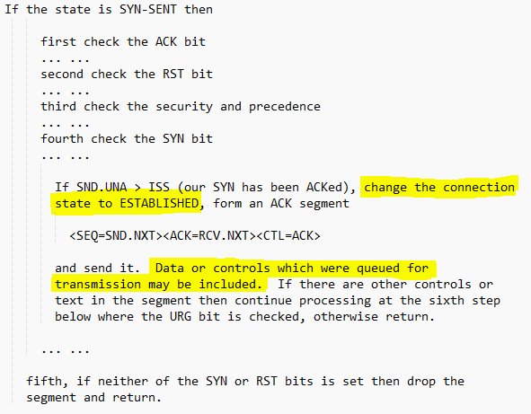

<!-- TOC -->

- [1. tcp 协议](#1-tcp-协议)
- [2. 三次握手 和 四次挥手](#2-三次握手-和-四次挥手)
    - [2.3. 分析二、四次握手的过程。](#23-分析二四次握手的过程)
    - [2.2. 三次握手的源来:](#22-三次握手的源来)
        - [2.2.1. 原文](#221-原文)
    - [2.4. 四次挥手](#24-四次挥手)
    - [2.1. 说明](#21-说明)
        - [2.1.1. TCP 5种报文：](#211-tcp-5种报文)
- [3. 疑问](#3-疑问)

<!-- /TOC -->

<a id="markdown-1-tcp-协议" name="1-tcp-协议"></a>
## 1. tcp 协议


- 序列号seq：占4个字节，用来标记数据段的顺序，TCP把连接中发送的所有数据字节都编上一个序号，第一个字节的编号由本地随机产生；给字节编上序号后，就给每一个报文段指派一个序号；序列号seq就是这个报文段中的第一个字节的数据编号。
- 确认号ack：占4个字节，期待收到对方下一个报文段的第一个数据字节的序号；序列号表示报文段携带数据的第一个字节的编号；而确认号指的是期望接收到下一个字节的编号；因此当前报文段最后一个字节的编号+1即为确认号。
- 确认ACK：占1位，仅当ACK=1时，确认号字段才有效。ACK=0时，确认号无效
- 同步SYN：连接建立时用于同步序号。当SYN=1，ACK=0时表示：这是一个连接请求报文段。若同意连接，则在响应报文段中使得SYN=1，ACK=1。因此，SYN=1表示这是一个连接请求，或连接接受报文。SYN这个标志位只有在TCP建产连接时才会被置1，握手完成后SYN标志位被置0。
- 终止FIN：用来释放一个连接。FIN=1表示：此报文段的发送方的数据已经发送完毕，并要求释放运输连接
**PS：ACK、SYN和FIN这些大写的单词表示标志位，其值要么是1，要么是0；ack、seq小写的单词表示序号。**

|字段|含义|
|:---|:----|:---|
|URG|紧急指针是否有效。为1，表示某一位需要被优先处理|
|ACK|确认号是否有效，一般置为1。|
|PSH|提示接收端应用程序立即从TCP缓冲区把数据读走。|
|RST|对方要求重新建立连接，复位。|
|SYN|请求建立连接，并在其序列号的字段进行序列号的初始值设定。建立连接，设置为1|
|FIN|希望断开连接。|

<a id="markdown-2-三次握手-和-四次挥手" name="2-三次握手-和-四次挥手"></a>
## 2. 三次握手 和 四次挥手


- 第一次握手：建立连接时，客户端发送syn包（syn=j）到服务器，并进入SYN_SENT状态，等待服务器确认；SYN：同步序列编号（Synchronize Sequence Numbers）。
- 第二次握手：服务器收到syn包，必须确认客户的SYN（ack=j+1），同时自己也发送一个SYN包（syn=k），即SYN+ACK包，此时服务器进入SYN_RECV状态；
- 第三次握手：客户端收到服务器的SYN+ACK包，向服务器发送确认包ACK(ack=k+1），此包发送完毕，客户端和服务器进入ESTABLISHED（TCP连接成功）状态，完成三次握手。

<a id="markdown-23-分析二四次握手的过程" name="23-分析二四次握手的过程"></a>
### 2.3. 分析二、四次握手的过程。

四次握手的过程：

|握手次数|方向|说明
|:---:|:----:|:---|
|1 |A -> B |SYN + A-ISN|
|2 |B -> A |SYN + ACK; 并记录A-ISN 到本地, 生成B-seq|
|3 |B -> A |SYN + B-ISN|
|4 |A -> B |记录B-ISN 到本地，生成A-seq|

很显然2 和3这两个步骤可以合并，只需要三次握手，可以提高连接的速度与效率。

> **当一个新连接建立时，初始序列号（initial sequence number ISN）生成器会生成一个新的32位的 ISN。这个生成器会用一个32位长的时钟，差不多4µs 增长一次，因此 ISN 会在大约4.55小时循环一次（2^32位的计数器，需要```2^32*4 µs```才能自增完，除以1小时共有多少µs便可算出 ```2^32*4 /(1*60*60*1000*1000)=4.772185884)``` 而一个段在网络中并不会比最大分段寿命（Maximum Segment Lifetime (MSL) ，默认使用2分钟）长，MSL 比4.55小时要短，所以我们可以认为 ISN 会是唯一的。**


二次握手的过程：
|握手次数|方向|说明
|:---:|:----:|:---|
|1 |A -> B | SYN + A-ISN |
|2 |B -> B | SYN + B-ISN + B-seq|

这里有一个问题，A与B就A的初始序列号达成了一致，这里是1000。但是B无法知道A是否已经接收到自己的同步信号，如果这个同步信号丢失了，A和B就B的初始序列号将无法达成一致。

于是TCP的设计者将SYN这个同步标志位SYN设计成占用一个字节的编号（FIN标志位也是），既然是一个字节的数据，按照TCP对有数据的TCP segment 必须确认的原则，所以在这里A必须给B一个确认，以确认A已经接收到B的同步信号。

- 如果A发给B的确认丢了，该如何？

> A会超时重传这个ACK吗？不会！TCP不会为没有数据的ACK超时重传。
那该如何是好？B如果没有收到A的ACK，会超时重传自己的SYN同步信号，一直到收到A的ACK为止。

<a id="markdown-22-三次握手的源来" name="22-三次握手的源来"></a>
### 2.2. 三次握手的源来:
1. A 发送SYN 报文给B，这是第一次报文交互。
2. B发送ACK确认A的SYN报文，这是第二次报文交互
3. B发送自己的SYN报文给A，这是第三次报文交互
4. A需要ACK确认B的SYN报文，这是第四次报文交互

以上的演绎没有问题，但是报文2、3为何要分开发送呢？增加了延迟不说，同时还白白浪费了网络的带宽，完全可以将报文2、3合并起来，不就是在报文2的ACK状态位的位置置“1”就结了吗？
这就是三次消息交互的由来！

<a id="markdown-221-原文" name="221-原文"></a>
#### 2.2.1. 原文

TCP作为一种可靠传输控制协议，其核心思想：既要保证数据可靠传输，又要提高传输的效率，而用三次恰恰可以满足以上两方面的需求！

TCP可靠传输的精髓：TCP连接的一方A，由操作系统动态随机选取一个32位长的序列号（Initial Sequence Number），假设A的初始序列号为1000，以该序列号为原点，对自己将要发送的每个字节的数据进行编号，1001，1002，1003 ...，并把自己的初始序列号ISN告诉B，让B有一个思想准备，什么样编号的数据是合法的，什么编号是非法的，比如编号900就是非法的，同时B还可以对A每一个编号的字节数据进行确认。如果A收到B确认编号为2001，则意味着字节编号为1001-2000，共1000个字节已经安全到达。
同理B也是类似的操作，假设B的初始序列号ISN为2000，以该序列号为原点，对自己将要发送的每个字节的数据进行编号，2001，2002，2003 ...，并把自己的初始序列号ISN告诉A，以便A可以确认B发送的每一个字节。如果B收到A确认编号为4001，则意味着字节编号为2001-4000，共2000个字节已经安全到达。

一句话概括，TCP连接握手，握的是啥: **通信双方数据原点的序列号！**

<a id="markdown-24-四次挥手" name="24-四次挥手"></a>
### 2.4. 四次挥手


1. 客户端进程发出连接释放报文，并且停止发送数据。释放数据报文首部，FIN=1，其序列号为seq=u（等于前面已经传送过来的数据的最后一个字节的序号加1），此时，客户端进入FIN-WAIT-1（终止等待1）状态。 TCP规定，FIN报文段即使不携带数据，也要消耗一个序号。
2. 服务器收到连接释放报文，发出确认报文，ACK=1，ack=u+1，并且带上自己的序列号seq=v，此时，服务端就进入了CLOSE-WAIT（关闭等待）状态。TCP服务器通知高层的应用进程，客户端向服务器的方向就释放了，这时候处于半关闭状态，即客户端已经没有数据要发送了，但是服务器若发送数据，客户端依然要接受。这个状态还要持续一段时间，也就是整个CLOSE-WAIT状态持续的时间。
3. 客户端收到服务器的确认请求后，此时，客户端就进入FIN-WAIT-2（终止等待2）状态，等待服务器发送连接释放报文（在这之前还需要接受服务器发送的最后的数据）。
4. 服务器将最后的数据发送完毕后，就向客户端发送连接释放报文，FIN=1，ack=u+1，由于在半关闭状态，服务器很可能又发送了一些数据，假定此时的序列号为seq=w，此时，服务器就进入了LAST-ACK（最后确认）状态，等待客户端的确认。
5. 客户端收到服务器的连接释放报文后，必须发出确认，ACK=1，ack=w+1，而自己的序列号是seq=u+1，此时，客户端就进入了TIME-WAIT（时间等待）状态。注意此时TCP连接还没有释放，必须经过2∗∗MSL（最长报文段寿命）的时间后，当客户端撤销相应的TCB后，才进入CLOSED状态。
6. 服务器只要收到了客户端发出的确认，立即进入CLOSED状态。同样，撤销TCB后，就结束了这次的TCP连接。可以看到，服务器结束TCP连接的时间要比客户端早一些。

|握手次数|方向|说明|状态|
|:---:|:----:|:---|---|
|1 |A -> B |FIN + A-seq=u|A = FIN-WAIT-1, B = CLOSE-WAIT|
|2 |B -> A |ACK + B-seq=v, ack=u+1|A = FIN-WAIT-2, B = LASK-ACK|
|3 |B -> A |FIN + ACK, B-seq=w, ack=u+1|A = TIME-WAIT, B = CLOSED|
|4 |A -> B |ACK B-seq=u+1, ack=w+1|A = CLOSED|

- 这里我给出每个状态所包含的含义，有兴趣的可以看看：
   - LISTEN：侦听来自远方 TCP 端口的连接请求。
   - SYN-SENT：在发送连接请求后等待匹配的连接请求。
   - SYN-RECEIVED：在收到和发送一个连接请求后等待对连接请求的确认。
   - ESTABLISHED：代表一个打开的连接，数据可以传送给用户。
   - FIN-WAIT-1：等待远程 TCP 的连接中断请求，或先前的连接中断请求的确认。
   - FIN-WAIT-2：从远程 TCP 等待连接中断请求。
   - CLOSE-WAIT：等待从本地用户发来的连接中断请求。
   - CLOSING：等待远程 TCP 对连接中断的确认。
   - LAST-ACK：等待原来发向远程 TCP 的连接中断请求的确认。
   - TIME-WAIT：等待足够的时间以确保远程 TCP 接收到连接中断请求的确认。
   - CLOSED：没有任何连接状态。

<a id="markdown-21-说明" name="21-说明"></a>
### 2.1. 说明

<a id="markdown-211-tcp-5种报文" name="211-tcp-5种报文"></a>
#### 2.1.1. TCP 5种报文：
1. SYN
2. Data （唯一携带用户数据）
3. FIN
4. Reset
5. ACK

- 1、2、3分别为建立连接、数据传输、断开连接，这三种报文对方接收到一定要ACK确认，为何要确认，因为这就是可靠传输的依赖的机制。如果对方在超时时间内不确认，发送方会一直重传，直到对方确认为止、或到达重传上限次数而Reset连接。
- 4、5 为重置连接报文、确认ACK报文，这两种报文对方接收到要ACK确认吧？不需要！自然发送方也不会重传这2种类型的报文。
- 为何Reset报文不需要ACK确认?
> 因为发送Reset报文的一端，在发送完这个报文之后，和该TCP Session有关的内存结构体瞬间全部释放，无论对方收到或没有收到，关系并不大。
- 如果对方收到Reset报文，也会释放该TCP Session 的相关内存结构体。
> 如果对方没有收到Reset 报文，可能会继续发送让接收方弹射出Reset报文的报文，到最后对方一样会收到Reset 报文，并最终释放内存。
- 为何ACK报文不需要ACK确认?
> 这里的ACK报文，是指没有携带任何数据的裸ACK报文，对方收到这样的ACK报文，自然也不需要ACK。否则，对方为了ACK己方的ACK，那己方收到对方的ACK，也要ACK对方的ACK，这就是一个死循环，永无止息。所以为了避免这个死循环，一律不允许ACK对方的裸ACK报文。

<a id="markdown-3-疑问" name="3-疑问"></a>
## 3. 疑问

- 为什么连接的时候是三次握手，关闭的时候却是四次握手？

>因为当Server端收到Client端的SYN连接请求报文后，可以直接发送SYN+ACK报文。其中ACK报文是用来应答的，SYN报文是用来同步的。但是关闭连接时，当Server端收到FIN报文时，很可能并不会立即关闭SOCKET，所以只能先回复一个ACK报文，告诉Client端，"你发的FIN报文我收到了"。只有等到我Server端所有的报文都发送完了，我才能发送FIN报文，因此不能一起发送。故需要四步握手。

- 为什么TIME_WAIT状态需要经过2MSL(最大报文段生存时间)才能返回到CLOSE状态？
> 虽然按道理，四个报文都发送完毕，我们可以直接进入CLOSE状态了，但是我们必须假象网络是不可靠的，有可以最后一个ACK丢失。所以TIME_WAIT状态就是用来重发可能丢失的ACK报文。在Client发送出最后的ACK回复，但该ACK可能丢失。Server如果没有收到ACK，将不断重复发送FIN片段。所以Client不能立即关闭，它必须确认Server接收到了该ACK。Client会在发送出ACK之后进入到TIME_WAIT状态。Client会设置一个计时器，等待2MSL的时间。如果在该时间内再次收到FIN，那么Client会重发ACK并再次等待2MSL。所谓的2MSL是两倍的MSL(Maximum Segment Lifetime)。MSL指一个片段在网络中最大的存活时间，2MSL就是一个发送和一个回复所需的最大时间。如果直到2MSL，Client都没有再次收到FIN，那么Client推断ACK已经被成功接收，则结束TCP连接。

- 为什么不能用两次握手进行连接？
> 3次握手完成两个重要的功能，既要双方做好发送数据的准备工作(双方都知道彼此已准备好)，也要允许双方就初始序列号进行协商，这个序列号在握手过程中被发送和确认。
现在把三次握手改成仅需要两次握手，死锁是可能发生的。作为例子，考虑计算机S和C之间的通信，假定C给S发送一个连接请求分组，S收到了这个分组，并发 送了确认应答分组。按照两次握手的协定，S认为连接已经成功地建立了，可以开始发送数据分组。可是，C在S的应答分组在传输中被丢失的情况下，将不知道S 是否已准备好，不知道S建立什么样的序列号，C甚至怀疑S是否收到自己的连接请求分组。在这种情况下，C认为连接还未建立成功，将忽略S发来的任何数据分 组，只等待连接确认应答分组。而S在发出的分组超时后，重复发送同样的分组。这样就形成了死锁。

- 如果已经建立了连接，但是客户端突然出现故障了怎么办？
> TCP还设有一个保活计时器，显然，客户端如果出现故障，服务器不能一直等下去，白白浪费资源。服务器每收到一次客户端的请求后都会重新复位这个计时器，时间通常是设置为2小时，若两小时还没有收到客户端的任何数据，服务器就会发送一个探测报文段，以后每隔75秒钟发送一次。若一连发送10个探测报文仍然没反应，服务器就认为客户端出了故障，接着就关闭连接。

- 三次握手中第三次可以传递数据吗？



> 可以！ 重点是这句 “Data or controls which were queued for transmission may be included”，也就是说标准表示，第三次握手的ACK包是可以携带数据。
