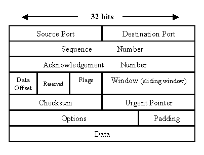
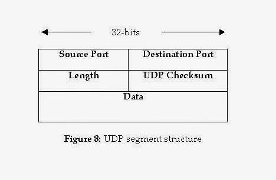

<!-- TOC -->

- [udp 面试题](#udp-面试题)
    - [UDP包最好为多大？](#udp包最好为多大)
        - [前戏](#前戏)
        - [网络原理](#网络原理)
    - [为什么不直接使用IP协议而要额外增加一个UDP协议呢？](#为什么不直接使用ip协议而要额外增加一个udp协议呢)
    - [TCP与UDP之间的区别](#tcp与udp之间的区别)

<!-- /TOC -->

## udp 面试题

### UDP包最好为多大？

由于UDP协议传输数据的特性，面向无连接的。通俗的讲客户端发送一包数据给服务端，发送完就不管了，不管它是否到达，或者丢了。这样就不用管分包的问题了，因为如果像tcp那边分包，是保证不了顺序的，这样会有很多其他的问题。所以如果需要用UDP一次性发送很多数据，需要在上层做很多逻辑，保证数据的顺序，这样也就比较麻烦了。

#### 前戏

进行UDP编程的时候,我们很容易会问自己问题，一次发送多少bytes好？
of course，这个没有标准答案，相对于不同的系统,不同的要求,其得到的答案也是大不一样的，我这里仅对像QQ这样一类的及时聊天消息传输的情况作分析，对于其他情况，你或许也能得到一点帮助。

#### 网络原理

首先，我们知道，TCP/IP通常被认为是一个五层协议系统：包括物理层，数据链路层、网络层、运输层、应用层 。UDP属于运输层，下面我们由下至上一步一步来看。

- 结论1：局域网环境下，建议将UDP数据控制在1472字节以下，为什么控制在这么个奇葩的数字字节一下？我们慢慢分析下。

    我们都知道，以太网(Ethernet)数据帧的长度必须在46-1500字节之间,这是由以太网的物理特性决定的，这个1500字节被称为链路层的MTU(最大传输单元)。但这并不是指链路层的长度被限制在1500字节，其实这这个MTU指的是链路层的数据区，并不包括链路层的首部和尾部的18个字节。连路层的数据区通常情况下就是IP数据报了。所以，事实上这个1500字节就是网络层IP数据报的长度限制。因为IP数据报的首部为20字节，所以IP数据报的数据区长度最大为1480字节。而这个1480字节就是用来放TCP传来的TCP报文段或者UDP传来的UDP数据报的(如果读者对UDP包不清楚可以查看本人前几天的关于UDP的解析)。又因为UDP数据报的首部8字节，所以UDP数据报的数据区最大长度为1472字节。这个1472字节就是我们可以使用的字节数。

    怎么样？看了这样的分析之后是不是清晰了很多。

    这个时候读者可能会有一个疑问，我自己也有一个疑问。

    当我们发送的UDP数据大于1472的时候会怎样呢？ 这也就是说IP数据报大于1500字节，大于MTU，这个时候发送方IP层就需要分片(fragmentation)。把数据报分成若干片，使每一片都小于MTU，而接收方IP层则需要进行数据报的重组。这样就会多做许多事情，而更严重的是，由于UDP的特性，当某一片数据传送中丢失时，接收方无法重组数据报，将导致丢弃整个UDP数据报。

    因此，在一般的局域网环境下，我建议将UDP的数据长度控制在1472字节以下为最佳

- 结论2：Internet编程时，建议将UDP数据控制在548字节以下

    进行Internet编程时则不同，因为Internet上的路由器可能会将MTU设为不同的值。如果我们假定MTU为1500来发送数据，而途经的某个网络的MTU值小于1500字节，那么系统将会使用一系列的机制来调整MTU值，使数据报能够顺利到达目的地，这样就会做许多不必要的操作。

    鉴于Internet上的标准MTU值为576字节，所以我建议在进行Internet的UDP编程时， 最好将UDP的数据长度控件在548字节(576-8-20)以内。

    感觉我上面的话貌似有问题，unix网络编程第一卷里说：ipv4协议规定ip层的最小重组缓冲区大小为576！所以，建议udp包不要超过这个大小，而不是因为internet的标准MTU是576！

### 为什么不直接使用IP协议而要额外增加一个UDP协议呢？ 

UDP(User Datagram Protocol)传输与IP传输非常类似。你可以将UDP协议看作IP协议暴露在传输层的一个接口。UDP协议同样以数据包(datagram)的方式传输，它的传输方式也是"Best Effort"的，所以UDP协议也是不可靠的(unreliable)。

**那么，我们为什么不直接使用IP协议而要额外增加一个UDP协议呢？** 

一个重要的原因是IP协议中并没有端口(port)的概念。IP协议进行的是IP地址到IP地址的传输，这意味者两台计算机之间的对话。但每台计算机中需要有多个通信通道，并将多个通信通道分配给不同的进程使用(关于进程，可以参考Linux进程基础)。一个端口就代表了这样的一个通信通道。正如我们在邮局和邮差中提到的收信人的概念一样。UDP协议实现了端口，从而让数据包可以在送到IP地址的基础上，进一步可以送到某个端口。

尽管UDP协议非常简单，但它的产生晚于更加复杂的TCP协议。早期的网络开发者开发出IP协议和TCP协议分别位于网络层和传输层，所有的通信都要先经过TCP封装，再经过IP封装(应用层->TCP->IP)。开发者将TCP/IP视为相互合作的套装。

但很快，网络开发者发现，IP协议的功能和TCP协议的功能是相互独立的。对于一些简单的通信，我们只需要“Best Effort”式的IP传输就可以了，而不需要TCP协议复杂的建立连接的方式(特别是在早期网络环境中，如果过多的建立TCP连接，会造成很大的网络负担，而UDP协议可以相对快速的处理这些简单通信)。UDP协议随之被开发出来，作为IP协议在传输层的"傀儡"。这样，网络通信可以通过应用层->UDP->IP的封装方式，绕过TCP协议。由于UDP协议本身异常简单，实际上只为IP传输起到了桥梁的作用。我们将在TCP协议的讲解中看到更多TCP协议和UDP协议的对比。

UDP的数据包同样分为头部(header)和数据(payload)两部分。UDP是传输层(transport layer)协议，这意味着UDP的数据包需要经过IP协议的封装(encapsulation)，然后通过IP协议传输到目的电脑。随后UDP包在目的电脑拆封，并将信息送到相应端口的缓存中。

上面的source port和destination port分别为UDP包的出发端口和目的地端口。Length为整个UDP包的长度。

checksum的算法与IP协议的header checksum算法相类似。然而，UDP的checksum所校验的序列包括了整个UDP数据包，以及封装的IP头部的一些信息(主要为出发地IP和目的地IP)。这样，checksum就可以校验IP：端口的正确性了。在IPv4中，checksum可以为0，意味着不使用checksum。IPv6要求必须进行checksum校验。

### TCP与UDP之间的区别

1. 基于连接vs无连接

    TCP是面向连接的协议，而UDP是无连接的协议。这意味着tcp 两端必须先建立连接，才能通讯；而udp 没有这样的要求，所以udp 支持一对一（单播）、 一对多（组播）、一对所有（广播）

    
    #### 单播: 一对一

    - 简介: 两个节点之间的通信，一个发送者一个接收者

    - 特点
        1. 服务器及时响应客户机的请求。
        2. 服务器针对每个客户不通的请求发送不通的数据，容易实现个性化服务。
        3. 允许在Internet宽带网上传输

    - 应用
        - 你在收发电子邮件、浏览网页时，必须与邮件服务器、Web服务器建立连接

    - 编程实现方式: 
        - 发送者指定接收者的地址（host和port）发送信息

    
    #### 广播: 一对所有

    - 简介: 一对所有，只能在子网中传播（在同一个路由器中传播），子网上的所有节点都能收到信息
    - 特点
        1. 网络设备简单，维护简单，布网成本低廉。
        2. 由于服务器不用向每个客户机单独发送数据，所以服务器流量负载极低。
        3. 不允许在Internet宽带网上传输
    - 应用
        - 客户机通过DHCP自动获得IP地址的过程就是通过广播来实现的
    - 广播风暴
        - 同一个子网内多点同时发送广播，会将带宽占满，造成网络拥塞。
        - 解决：不能根本解决，可以通过划分子网的方式，将广播限定在一定范围内，起到隔绝广播的目的。
    - 编程实现方式
        - 255.255.255.255是广播地址，发送者指定广播地址发送信息，就是向整个子网发送广播，子网内的节点都会受到广播

    
    #### 多播(组播): 一对多

    - 简介: 一对多，一个发送者对多个接收者
    - 特点:
        1. 组播解决了单播和广播方式效率低的问题，它提高了数据传送效率，减少了骨干网络出现拥塞的可能性。
        2. 允许在Internet宽带网上传输
    - 应用
        - 网上视频会议、网上视频点播
    - 编程实现方式
        - 多播IP地址就是D类IP地址。即224.0.0.0至239.255.255.255之间的IP地址。
        - 224.0.0.0～224.0.0.255为预留的组播地址（永久组地址），地址224.0.0.0保留不做分配，其它地址供路由协议使用。
        - 224.0.1.0～238.255.255.255为用户可用的组播地址（临时组地址），全网范围内有效。
        - 239.0.0.0～239.255.255.255为本地管理组播地址，仅在特定的本地范围内有效。
        - 发送者和接受者都添加一组多播地址

2. 可靠性

    TCP提供交付保证,这意味着一个使用TCP协议发送的消息是保证交付给客户端的。如果消息在传输过程中丢失,那么它将重发,这是由TCP协议本身控制的。另一方面,UDP是不可靠的,它不提供任何交付的保证。一个数据报包在运输途中可能会丢失。这就是为什么UDP是不适合保证交付的项目。

3. 有序性

    除了提供交付保证，为TCP也保证了消息的有序性。该消息将以从服务器端发出的同样的顺序发送到客户端，尽管这些消息到网络的另一端时可能是无序的。TCP协议将会为你排好序。
    
    UDP不提供任何有序性或序列性的保证。数据包将以任何可能的顺序到达。这就是为什么TCP是适合需要顺序交付方式的应用，尽管有基于UDP的协议通过使用序列号和重传来提供有序和可靠性的应用，如TIBCO Rendezvous，他实际上就是一个基于UDP的应用。

4. 数据边界

    TCP不保存数据的边界，而UDP保证。在传输控制协议，数据以字节流的形式发送，并没有明显的标志表明传输信号消息（段）的边界。在UDP中，数据包单独发送的，只有当他们到达时，才会再次集成。包有明确的界限来哪些包已经收到，这意味着在消息发送后，在接收器接口将会有一个读操作，来生成一个完整的消息。虽然TCP也将在收集所有字节之后生成一个完整的消息，但是这些信息在传给传输给接受端之前将储存在TCP缓冲区，以确保更好的使用网络带宽

5. 速度

    总而言之，TCP速度比较慢，而UDP速度比较快，因为TCP必须创建连接，以保证消息的可靠交付和有序性，他需要做比UDP多的多的事。这就是为什么UDP更适用于对速度比较敏感的应用，例如：在线视频媒体，电视广播和多人在线游戏。

6. 重量级vs轻量级

    由于上述的开销，TCP被认为是重量级的协议，而与之相比，UDP协议则是一个轻量级的协议。因为UDP传输的信息中不承担任何间接创造连接，保证交货或秩序的的信息。这也反映在用于承载元数据的头的大小。

7. 数据包结构

    
    

8. 拥塞或流控制

    TCP有流量控制。在任何用户数据可以被发送之前，TCP需要三数据包来设置一个套接字连接。TCP处理的可靠性和拥塞控制。另一方面，UDP不能进行流量控制。

9. 用法和应用

    在互联网中，TCP和UDP都运行在哪些环境中了？
    
    在了解了TCP和UDP之间的关键差异之后，我们可以很容易地得出结论，哪种情况适合他们。由于TCP提供可靠交付和有序性的保证，它是最适合需要高可靠并且对传输时间要求不高的应用。UDP是更适合的应用程序需要快速，高效的传输的应用，如游戏。UDP是无状态的性质，在服务器端需要对大量客户端产生的少量请求进行应答的应用中是非常有用的。在实践中，TCP被用于金融领域，如FIX协议是一种基于TCP的协议，而UDP是大量使用在游戏和娱乐场所。

总结：

    基于TCP协议的最好例子是HTTP协议和HTTPS协议，他们几乎存在于互联网的任何地方，实际上，绝大多数你所熟悉的通常协议，都是基于TCP的，例如：Telnet，FTP以及SMTP协议。UDP协议没有TCP协议那么受欢迎，但是也被广泛应用，比如DHCP以及DNS协议，其他还有一些基于UDP的协议如SNMP,TFTP,BOOTP以及NFS（早期版本）。

    特别需要记住的是，TCP是面向连接的，可靠的，缓慢的，可靠交付以及保证消息顺序的，而UDP是无连接的，不可靠的，没有序列保证，但是一个快速传输的协议。TCP头开销也比UDP高得多，因为它每个数据包中药发送更多的元数据。值得一提的是，TCP头的大小是20个字节，而UDP头大小是8个字节。如果你不想丢失任何消息，使用TCP协议，而UDP能够高速传输数据，并且丢失少量的数据包是可以接受的，如视频流或在线多玩家游戏。对于基于TCP / UDP协议，运行在Linux上的应用，需要牢记的基本网络命令，如Telnet和netstat，他们极大的帮助调试和排除任何连接问题。

TCP、UDP对比

| 特效 | TCP |UDP |
|:---|:---|:---| 	  
| 可靠性|可靠|不可靠|
| 连接性|面向连接|无连接|
| 报文|面向字节流|面向报文|
| 效率|传输效率低|传输效率高|
| 双工性|全双工|一对一、一对多、多对一、多对多|
| 流量控制|有(滑动窗口)|无|
| 拥塞控制|有(慢开始、拥塞避免、快重传、快恢复)|无|
